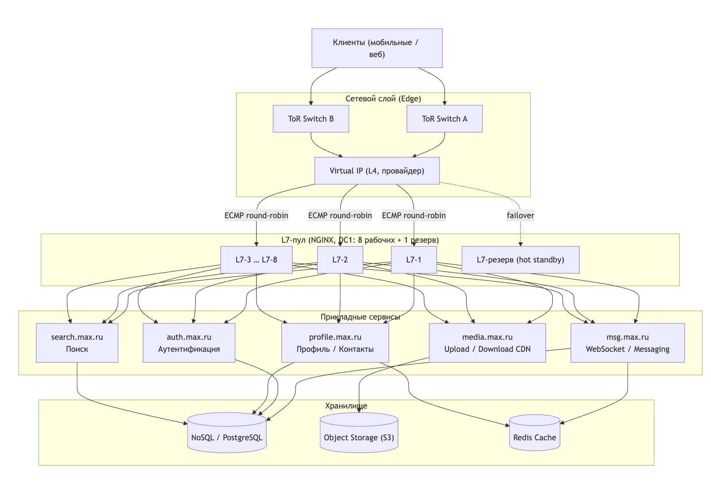
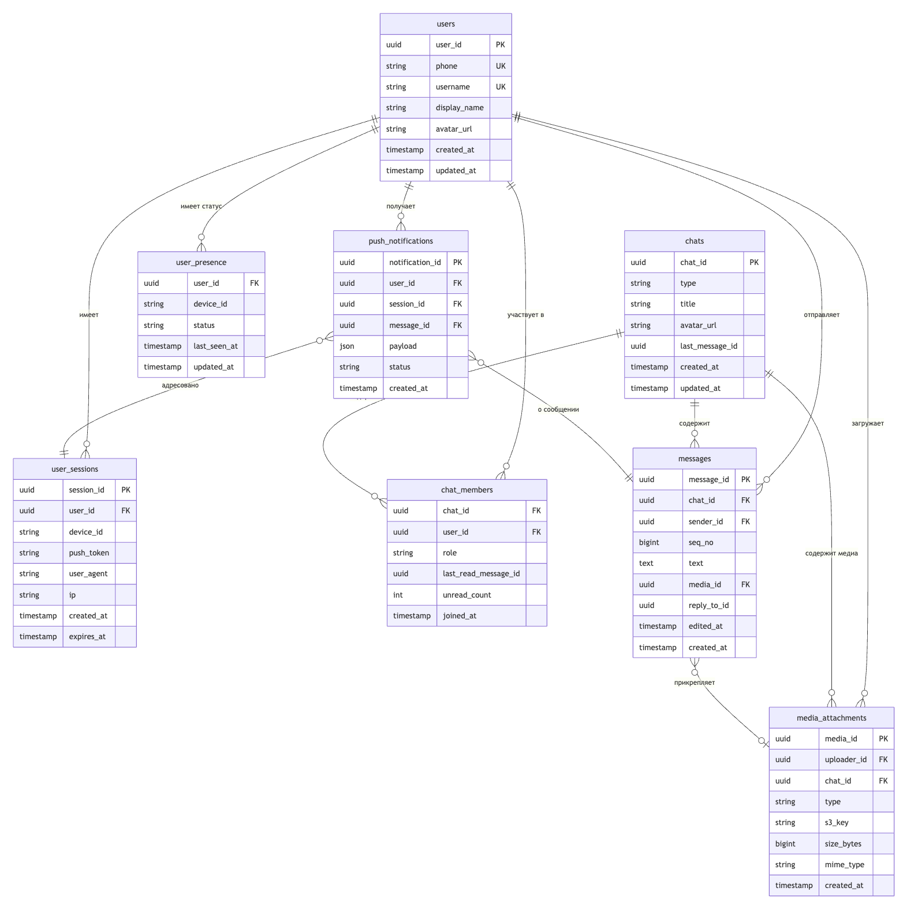
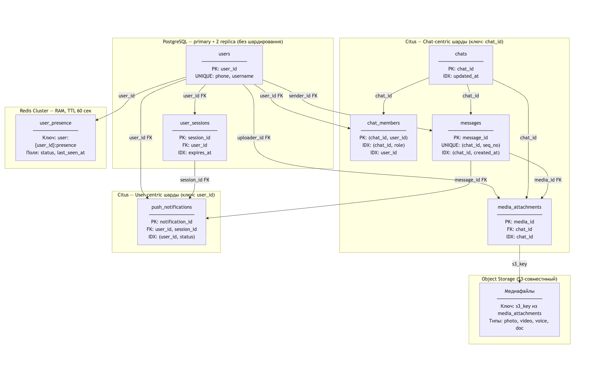

# Проектирование высоконагруженных систем: Мессенджер MAX

## Содержание

1. [Тема и целевая аудитория](#1-тема-и-целевая-аудитория)
2. [Расчёт нагрузки](#2-расчёт-нагрузки)
   - 2.1. [Продуктовые метрики](#21-продуктовые-метрики-отправная-точка)
   - 2.2. [Методология расчёта технических метрик](#22-методология-расчёта-технических-метрик)
   - 2.3. [Расчёт RPS](#23-расчёт-rps-запросов-в-секунду)
   - 2.4. [Расчёт сетевого трафика](#24-расчёт-сетевого-трафика-bandwidth)
   - 2.5. [Расчёт хранилища](#25-расчёт-хранилища-capacity-planning-на-1-год)
   - 2.6. [Источники (Расчёт нагрузки)](#26-источники)
3. [Глобальная балансировка нагрузки](#3-глобальная-балансировка-нагрузки)
   - 3.1. [Функциональное разбиение по доменам](#31-функциональное-разбиение-по-доменам)
   - 3.2. [Расположение датацентров](#32-расположение-датацентров)
   - 3.3. [Распределение запросов и расчёт профиля нагрузки](#33-распределение-запросов-и-расчёт-профиля-нагрузки)
   - 3.4. [Схема DNS балансировки](#34-схема-dns-балансировки)
   - 3.5. [Источники (Балансировка)](#35-источники)
4. [Локальная балансировка нагрузки](#4-локальная-балансировка-нагрузки)
   - 4.1. [Механизм резервирования](#41-механизм-резервирования)
   - 4.2. [Расчёт количества L7-балансировщиков по ДЦ](#42-расчёт-количества-l7-балансировщиков-по-дц)
   - 4.3. [Итоговое количество балансировщиков](#43-итоговое-количество-балансировщиков)
   - 4.4. [Схема локальной балансировки](#44-схема-локальной-балансировки)
5. [Логическая схема БД](#5-логическая-схема-бд)
   - 5.1. [Описание таблиц](#51-описание-таблиц)
   - 5.2. [Нагрузка на чтение и запись](#52-нагрузка-на-чтение-и-запись)
   - 5.3. [Требования к консистентности](#53-требования-к-консистентности)
   - 5.4. [Распределение нагрузки по ключам](#54-распределение-нагрузки-по-ключам)
   - 5.5. [Логическая схема (ERD)](#55-логическая-схема-erd)
6. [Физическая схема БД](#6-физическая-схема-бд)
   - 6.1. [Физические проекции данных](#61-физические-проекции-данных)
   - 6.2. [Выбор СУБД по таблицам](#62-выбор-субд-по-таблицам)
   - 6.3. [Индексы](#63-индексы)
   - 6.4. [Денормализация](#64-денормализация)
   - 6.5. [Шардирование](#65-шардирование)
   - 6.6. [API-маппинг на физические объекты](#66-api-маппинг-на-физические-объекты)

---

## 1. Тема и целевая аудитория

**Мессенджер MAX** — это сервис обмена сообщениями внутри экосистемы VK, позволяющий пользователям общаться в личных и групповых чатах, обмениваться медиафайлами, совершать звонки и получать уведомления в реальном времени.

В приложении пользователи могут:
- Отправлять текстовые и голосовые сообщения
- Создавать личные и групповые чаты
- Отправлять фотографии, видео и документы
- Совершать аудио- и видеозвонки
- Получать push-уведомления
- Использовать реакции и стикеры

### Основные функции MVP
- Регистрация и авторизация пользователя
- Список диалогов
- Отправка сообщений в реальном времени
- Групповые чаты
- Отправка медиафайлов
- Уведомления о новых сообщениях

### Целевая аудитория
По данным источников:
- Около 75 млн зарегистрированных пользователей мессенджера
- Среднесуточная аудитория (DAU) — около 45 млн пользователей

**Распределение по регионам:**

| Регион              | Доля пользователей |
|--------------------|-----------------|
| Центральный ФО (Москва) | Основной рынок и максимальная нагрузка (~40%) |
| Северо-Западный ФО (СПб) | Высокая плотность пользователей (~25%) |
| Урал, Сибирь, ДВ | Активный рост мобильной аудитории (~20%) |
| Южный и Северо-Кавказский ФО | Региональная аудитория (~15%) |

---

## 2. Расчёт нагрузки

### 2.1. Продуктовые метрики (Отправная точка)

За основу масштаба системы взяты данные об аудитории мессенджера MAX. Моделирование активности (количество сообщений на человека) опирается на средние показатели глобальных мессенджеров.

| Метрика | Значение | Источник / Обоснование |
| :--- | :--- | :--- |
| **MAU** (Monthly Active Users) | **75 млн** | Данные пресс-службы MAX [[1]](#ref1). |
| **DAU** (Daily Active Users) | **45 млн** | Среднесуточный охват MAX [[1]](#ref1). |
| **Sticky Factor** (DAU/MAU) | **60 %** | Отражает вовлеченность (45/75), типичный уровень для мессенджеров. |
| **Отправка сообщений в день (на DAU)** | **40** | Глобальная статистика WhatsApp (~100 млрд сообщений на ~2.5 млрд пользователей) [[2]](#ref2). |
| **Доля медиа-вложений** | **14 %** | Выводится из публичных данных WhatsApp (2020): 4.5 млрд фото + 1 млрд видео в день при ~40 млрд отправленных сообщений = ~14% [[2]](#ref2)[[3]](#ref3). |
| **Коэффициент чтения (Fan-out)** | **2.5** | Выводится из данных WhatsApp: 100 млрд доставленных / 40 млрд отправленных = 2.5. Личные чаты дают ×2, групповые чаты (средний размер 5–10 чел.) поднимают среднее до 2.5 [[2]](#ref2). |

---

### 2.2. Методология расчёта технических метрик

Крупные IT-компании (Discord, Meta) не публикуют свои точные RPS, поэтому технические метрики вычисляются математически на основе продуктовых цифр [[4]](#ref4)[[5]](#ref5).

**Формулы перевода:**
*   `Средний RPS` = `(Кол-во пользователей × Действий в день) / Перевод суток в секунды`
*   `Пиковый RPS` = `Средний RPS × 2.0` (Суточная неравномерность: днем активнее, ночью нагрузка падает).
*   `Трафик (Bandwidth)` = `RPS × Средний размер запроса` (Считается в Мегабайтах в секунду, переводится в Гигабиты: `МБ/с × 8 / 1024`).

**Индустриальные константы (размеры данных):**
*   Размер текстового сообщения: **500 Байт** (Сами символы текста + JSON метаданные: ID чата, timestamp, sender_id) [[3]](#ref3).
*   Размер сжатого медиафайла: **1 Мегабайт** (Алгоритмы мессенджеров агрессивно сжимают фото до ~100-200 КБ, короткие видео/войсы до 2-3 МБ. Среднее значение для расчетов — 1 МБ).

---

### 2.3. Расчёт RPS (Запросов в секунду)

Вычисляем нагрузку на API (Application Servers).

**Расшифровка цифр, используемых в формулах ниже:**
*   **45 млн** — это DAU (количество активных пользователей в день, взято из пункта 1).
*   **40** — среднее количество отправляемых сообщений одним пользователем в день.
*   **86 400** — количество секунд в одних сутках (24 часа × 60 минут × 60 секунд). Эта цифра нужна, чтобы перевести суточную активность в запросы в секунду.
*   **2.5 (Fan-out)** — мультипликатор чтения, выведен из данных WhatsApp: 100 млрд доставленных / 40 млрд отправленных = 2.5. Личные чаты дают ×2, групповые чаты поднимают среднее до 2.5.
*   **14%** — доля сообщений с медиавложениями (фото + видео), выведена из публичных данных WhatsApp 2020: 4.5 млрд фото + 1 млрд видео при ~40 млрд отправленных сообщений.
*   **Пиковый RPS (×2)** — коэффициент неравномерности нагрузки. Ночью пользователи спят, а вечером нагрузка возрастает примерно в 2 раза от среднего значения.

| Метод API | Формула расчёта среднего RPS | Средний RPS | Пиковый RPS (×2) |
| :--- | :--- | :--- | :--- |
| **sendMessage** (отправка текста) | (45 000 000 × 40) / 86 400 сек | **~20 833** | **~41 666** |
| **receiveMessage** (доставка) | 20 833 RPS × 2.5 (Fan-out) | **~52 083** | **~104 166** |
| **uploadMedia** (загрузка файлов) | 20 833 RPS × 14% (доля медиа) | **~2 917** | **~5 834** |
| **downloadMedia** (чтение файлов) | 2 917 RPS × 2.5 (Fan-out) | **~7 292** | **~14 584** |
| **ИТОГО API Load** | Сумма всех методов | **~83 125** | **~166 250** |

---

### 2.4. Расчёт сетевого трафика (Bandwidth)

Вычисляем требуемую пропускную способность сетевого оборудования (Load Balancers, Edge-серверы / CDN).

| Тип трафика (Входящий + Исходящий) | Формула (Суммарный RPS × Размер) | МБ/сек | Gbit/s (Средний) | Gbit/s (Пик) |
| :--- | :--- | :--- | :--- | :--- |
| **Текстовый (JSON API)** | (20 833 + 52 083) × 500 Байт | ~36.5 МБ/с | **~0.29 Gbit/s** | **~0.57 Gbit/s** |
| **Медиа (Object / CDN)** | (2 917 + 7 292) × 1 МБ | ~10 209 МБ/с | **~79.8 Gbit/s** | **~159.6 Gbit/s** |
| **ИТОГО Трафик** | Текст + Медиа | ~10 246 МБ/с | **~80.1 Gbit/s** | **~160.2 Gbit/s** |

> **Вывод:** Текстовый трафик генерирует высокую нагрузку на CPU серверов (парсинг JSON, маршрутизация миллионов соединений), но занимает ничтожно мало канала (~0.6 Гбит/с). Основной сетевой канал «съедают» медиафайлы — с уточнённой долей медиа 14% и fan-out 2.5 требуется пропускная способность около **160 Gbit/s** на пиках.

---

### 2.5. Расчёт хранилища (Capacity Planning на 1 год)

Сколько жестких дисков потребуется для хранения истории сообщений за 1 год для 45 млн активных пользователей. В расчетах учитывается обязательная репликация данных `Factor 3` (сохранение одних и тех же данных на 3-х разных серверах для отказоустойчивости).

| Тип данных | Данных генерируется в сутки | За 1 год (Сырые данные) | Требуемое место (×3 Репликации) |
| :--- | :--- | :--- | :--- |
| **Тексты (БД/NoSQL)** | 45 млн × 40 × 500 Байт = **~0.9 ТБ/сут.** | 0.9 × 365 = **~328.5 ТБ** | **~0.98 ПБ (Петабайт)** |
| **Медиа (S3/Object)** | 45 млн × 40 × 14% × 1 МБ = **~252 ТБ/сут.** | 252 × 365 = **~91 980 ТБ** | **~276 ПБ (Петабайт)** |

> **Что использовать:** Для ~1 Петабайта текстовых метаданных потребуется распределенная NoSQL база (например, Cassandra или ScyllaDB, как используют в Discord [[4]](#ref4)). Для медиафайлов (~276 Петабайт) используется S3-совместимое хранилище (MinIO, Ceph или отказоустойчивые решения облачных провайдеров).

---

### 2.6. Источники

1. **MAX сообщил о регистрации в мессенджере ~75 млн пользователей, среднесуточный DAU ~45 млн** (Forbes, декабрь 2025). URL: [forbes.ru/tekhnologii/552209-max-soobsil-o-registracii-v-messendzere-75-mln-pol-zovatelej](https://www.forbes.ru/tekhnologii/552209-max-soobsil-o-registracii-v-messendzere-75-mln-pol-zovatelej) *(Базовые продуктовые метрики проекта).*
2. **Метрики пользовательского поведения WhatsApp** (TechCrunch, октябрь 2020). WhatsApp доставляет ~100 млрд сообщений в день при ~2.5 млрд MAU и ~1 млрд DAU. Из этих же данных: 4.5 млрд фото и 1 млрд видео в день → доля медиа ~14%; 100 млрд доставленных / ~40 млрд отправленных → fan-out ≈ 2.5. URL: [techcrunch.com/2020/10/29/whatsapp-is-now-delivering-roughly-100-billion-messages-a-day/](https://techcrunch.com/2020/10/29/whatsapp-is-now-delivering-roughly-100-billion-messages-a-day/) *(Обоснование показателей: 40 сообщений/день, доля медиа 14%, fan-out 2.5).*
3. **Методология расчёта System Design чатов:** "System Design Interview" by Alex Xu (Глава 12: Design a Chat System). URL: [bytebytego.com/courses/system-design-interview/design-a-chat-system](https://bytebytego.com/courses/system-design-interview/design-a-chat-system) *(Обоснование размера текстового сообщения — 500 байт: символы текста + JSON-метаданные).*
4. **Хранение миллиардов сообщений (Архитектура БД):** Блог инженеров Discord: "How Discord Stores Trillions of Messages". URL: [discord.com/blog/how-discord-stores-trillions-of-messages](https://discord.com/blog/how-discord-stores-trillions-of-messages) *(Архитектурные стандарты масштабирования хранилища и выбора NoSQL).*
5. **Масштабирование соединений:** Инженерный блог Meta (Facebook Messenger). Раскрывает работу с Fan-out архитектурой при высоких RPS. URL: [engineering.fb.com/2020/08/17/core-infra/messenger-scale/](https://engineering.fb.com/2020/08/17/core-infra/messenger-scale/)

---

## 3. Глобальная балансировка нагрузки

### 3.1. Функциональное разбиение по доменам

| Домен                | Функции                                   |
|---------------------|------------------------------------------|
| auth.max.ru          | Аутентификация, регистрация, сессии      |
| msg.max.ru           | Отправка/приём сообщений                  |
| media.max.ru         | Загрузка/скачивание медиа                |
| search.max.ru        | Поиск сообщений и чатов                   |
| profile.max.ru       | Работа с профилем пользователя           |

> Разделение доменов позволяет изолировать процессы, гибко распределять нагрузку по типам запросов и точечно масштабировать инфраструктуру дата-центров под конкретные нужды (например, сеть для `media`, CPU для `search`). Подобный подход (Microservices/SOA) используется в архитектуре WhatsApp и Telegram [^1].

---

### 3.2. Расположение датацентров

| ДЦ           | Город           | Цель                                           |
|--------------|----------------|-----------------------------------------------|
| DC1          | Москва         | Основной рынок, самая высокая плотность пользователей |
| DC2          | Санкт-Петербург| Резервный регион, снижение задержки для СЗФО  |
| DC3          | Новосибирск    | Сибирь и Дальний Восток, локальная доступность|
| DC4          | Ростов-на-Дону | Южный регион, разгрузка центральных узлов        |

> Географическое распределение ДЦ внутри страны учитывает огромную протяженность РФ. Это кратно снижает сетевую задержку (latency) для конечного пользователя и повышает отказоустойчивость сервиса (Disaster Recovery).

---

### 3.3. Распределение запросов и расчёт профиля нагрузки

Для корректного расчёта мощностей (сайзинга) серверов и сетевых каналов отталкиваемся от целевой аудитории и профиля потребления. За основу взяты среднерыночные показатели крупных мессенджеров в РФ (таких как Telegram и VK) [^2].

#### 3.3.1. Базовый расчёт аудитории (Baseline)
* **DAU (Ежедневная аудитория):** 40 000 000 пользователей.
* **Активность:** ~150 фоновых и активных запросов в сутки от одного пользователя (отправка текста, загрузка медиа, синхронизация, онлайн-статусы) [^3].
* **Всего запросов в сутки:** 40 млн × 150 = **6 000 000 000** (6 млрд запросов).
* **Средний RPS (Average):** 6 млрд / 86 400 сек. ≈ 70 000. Для запаса прочности берём **72 000 RPS**.
* **Пиковый RPS (Peak):** С учётом ярко выраженных вечерних региональных всплесков используем стандартный телеком-коэффициент x2.5 [^4]. Пиковая нагрузка составит: 72 000 × 2.5 = **180 000 RPS**.

#### 3.3.2. Распределение нагрузки по доменам (типам запросов)
Паттерны использования мессенджера неравномерны. Это критично для балансировщиков (L7), так как сервисы требуют совершенно разных ресурсов.

| Домен (Сервис) | Доля трафика | Средний RPS | Пиковый RPS | Специфика нагрузки на балансировщики |
| :--- | :---: | ---: | ---: | :--- |
| **msg.** | 60% | 43 200 | 108 000 | Удержание миллионов долгих TCP/WebSocket соединений, мелкие IOPS. |
| **media.** | 25% | 18 000 | 45 000 | «Тяжёлые» файлы. Требует максимальной пропускной способности сети (Bandwidth) и CDN. |
| **profile.** | 10% | 7 200 | 18 000 | Преимущественно чтение (read-heavy). Частые запросы статуса (online/offline). |
| **search.** | 5% | 3 600 | 9 000 | Сложные текстовые запросы. Высокая утилизация процессорного времени (CPU-bound). |

#### 3.3.3. Распределение нагрузки по географии
Трафик маршрутизируется по ДЦ в зависимости от плотности населения РФ (по Федеральным округам) [^5]. Разница часовых поясов сглаживает единый федеральный пик, но для надёжности пики закладываются изолированно для каждого кластера.

| ДЦ (Регион) | Зона покрытия (ФО) | Доля аудитории | Средний RPS | Пиковый RPS |
| :--- | :--- | :---: | ---: | ---: |
| **DC1: Москва** | ЦФО, ПФО (Центр и Поволжье) | **40%** | 28 800 | 72 000 |
| **DC2: Санкт-Петербург** | СЗФО (Северо-Запад) | **25%** | 18 000 | 45 000 |
| **DC3: Новосибирск** | УФО, СФО, ДВФО (Урал, Сибирь) | **20%** | 14 400 | 36 000 |
| **DC4: Ростов-на-Дону** | ЮФО, СКФО (Юг и Кавказ) | **15%** | 10 800 | 27 000 |
| **ВСЕГО** | **Вся территория РФ** | **100%** | **72 000** | **180 000** |

#### 3.3.4. Архитектурное обоснование
1. **Асимметрия Европейской части (65% трафика):** Москва и Санкт-Петербург принимают на себя основной удар, что коррелирует с проникновением широкополосного интернета. За счёт прямого магистрального канала (пинг ~10-15 мс) [^6] эти ДЦ работают как Active-Active резерв друг для друга (Cross-DC Failover).
2. **Изоляция Сибири (DC3):** Наличие ДЦ в Новосибирске — архитектурная необходимость. Пинг от Владивостока до Москвы составляет ~100-120 мс (законы физики и маршрутизация), что делает VoIP (голосовые вызовы) и real-time чат некомфортными. Новосибирский узел снижает задержку для Восточной РФ в 2.5–3 раза [^7].
3. **Локальная балансировка:** Полученные цифры RPS применяются для каждого ДЦ локально. Например, на `search.max.ru` в Москве в пике приходит всего 3 600 RPS (72 000 × 0.05). Это позволяет балансировщику внутри ДЦ направлять трафик на ограниченную группу мощных серверов, экономя бюджет.

---

### 3.4. Схема DNS балансировки

- Используется **GeoDNS** на федеральном уровне:
  - Резолвинг IP-адресов происходит на основе гео-базы (ASN провайдера или IP-адрес конечного пользователя).
  - Запрос гарантированно направляется на ближайший к пользователю ДЦ (Anycast маршрутизация).
- **Failover-сценарий (отказоустойчивость):**
  - Осуществляется непрерывный Health-check (проверка доступности) каждого L7-балансировщика в дата-центрах.
  - При аппаратном сбое или перегрузе регионального ДЦ (например, отказ DC4), GeoDNS в течение TTL (Time To Live = ~60 сек) автоматически переписывает A-записи, направляя южный трафик на ближайший резервный узел (DC1).

---

### 3.5. Источники

[^1]: Разделение логики мессенджера (Media CDN vs Messaging Protocol). Статья об архитектуре WhatsApp от HighScalability: [WhatsApp Architecture](http://highscalability.com/blog/2014/2/26/the-whatsapp-architecture-facebook-bought-for-19-billion.html)
[^2]: Статистика Mediascope: аудитория мессенджеров в России (DAU крупнейших платформ превышает 40-50 млн). [РБК: Данные Mediascope по Telegram/VK](https://www.rbc.ru/technology_and_media/10/01/2024/659d4c729a7947ac00f2e0f4)
[^3]: Профиль нагрузки пользователя (отправка сообщений, синхронизация контактов). Анализ трафика мессенджеров. [Среднее количество сообщений на пользователя](https://www.businessofapps.com/data/whatsapp-statistics/)
[^4]: Расчёт пиковой нагрузки (Evening Peak). Основы Capacity Planning (пик х2 - х3 от среднего). [AWS Capacity Planning](https://aws.amazon.com/architecture/well-architected/)
[^5]: Распределение аудитории основано на данных Росстата о численности населения по федеральным округам РФ. [Википедия: Население федеральных округов РФ](https://ru.wikipedia.org/wiki/Федеральные_округа_Российской_Федерации)
[^6]: Статистика сетевых задержек (Latency/Ping). Пинг Москва — Санкт-Петербург составляет ~10-15 мс. [Globalping Network Latency Map](https://www.jsdelivr.com/globalping)
[^7]: Обоснование Сибирского ДЦ. Задержка прохождения сигнала по ВОЛС от Москвы до Дальнего Востока превышает комфортные для реал-тайма 100 мс. Статья на Хабре о магистральных сетях РФ: [Магистральные сети связи в России](https://habr.com/ru/companies/selectel/articles/319400/)

---

## 4. Локальная балансировка нагрузки

Локальная балансировка описывает схему распределения трафика **внутри каждого дата-центра** — от точки входа (Edge) до прикладных сервисов.

### 4.1. Механизм резервирования

Для пула L7-балансировщиков применяется схема **N + 1**:
- `N` — минимальное число узлов, необходимых для обслуживания пиковой нагрузки.
- `+1` — один горячий резервный узел, готовый принять трафик при отказе любого из рабочих.

Схема `N × 2` (полное дублирование) избыточна для данного масштаба и применяется только при межрегиональном Active-Active failover на уровне GeoDNS (раздел 3.4).

**Два слоя балансировки внутри ДЦ:**
1. **L4-слой** — предоставляется провайдером ДЦ как управляемый сервис (Virtual IP / Anycast). Принимает входящий TCP-поток и распределяет его по пулу L7-узлов методом ECMP (Equal-Cost Multi-Path).
2. **L7-слой** — пул NGINX-узлов. Выполняет TLS Termination, маршрутизацию по доменам (`msg.max.ru`, `media.max.ru`, `auth.max.ru`, `profile.max.ru`, `search.max.ru`) и балансировку по прикладным сервисам методом Least Connections.

### 4.2. Расчёт количества L7-балансировщиков по ДЦ

**Исходные данные для расчёта (из раздела 2.3 и 3.3):**
- Суммарный пиковый RPS по всем ДЦ: **~166 250 RPS**
- Суммарный пиковый трафик: **~160.2 Gbit/s**
- Производительность одного L7-узла (24 CPU, NGINX): **10 274 HTTPS CPS** [^8] и **8.80 Gbit/s** [^9]

**Формулы:**

$$N_{ssl} = \left\lceil \frac{RPS_{peak}}{10\,274} \right\rceil, \quad N_{net} = \left\lceil \frac{BW_{peak}}{8.80} \right\rceil, \quad N = \max(N_{ssl},\, N_{net})$$

$$N_{total} = N + 1 \quad \text{(схема N+1)}$$

**Расчёт по каждому ДЦ:**

| ДЦ | Доля | Пиковый RPS | Пиковый трафик (Gbit/s) | N_ssl | N_net | N (рабочих) | N+1 (итого) |
| :--- | :---: | ---: | ---: | ---: | ---: | ---: | ---: |
| **DC1: Москва** | 40% | 66 500 | 64.1 | ⌈66 500 / 10 274⌉ = **7** | ⌈64.1 / 8.80⌉ = **8** | **8** | **9** |
| **DC2: Санкт-Петербург** | 25% | 41 563 | 40.1 | ⌈41 563 / 10 274⌉ = **5** | ⌈40.1 / 8.80⌉ = **5** | **5** | **6** |
| **DC3: Новосибирск** | 20% | 33 250 | 32.0 | ⌈33 250 / 10 274⌉ = **4** | ⌈32.0 / 8.80⌉ = **4** | **4** | **5** |
| **DC4: Ростов-на-Дону** | 15% | 24 938 | 24.0 | ⌈24 938 / 10 274⌉ = **3** | ⌈24.0 / 8.80⌉ = **3** | **3** | **4** |

### 4.3. Итоговое количество балансировщиков

| ДЦ | L4 (провайдер) | L7 рабочих | L7 резерв | L7 итого |
| :--- | :---: | :---: | :---: | :---: |
| DC1: Москва | 1 (VIP) | 8 | 1 | **9** |
| DC2: Санкт-Петербург | 1 (VIP) | 5 | 1 | **6** |
| DC3: Новосибирск | 1 (VIP) | 4 | 1 | **5** |
| DC4: Ростов-на-Дону | 1 (VIP) | 3 | 1 | **4** |
| **ВСЕГО** | **4** | **20** | **4** | **24** |

### 4.4. Схема локальной балансировки

Схема показана для **DC1 (Москва)** как наиболее нагруженного ДЦ. Остальные ДЦ имеют аналогичную топологию с меньшим числом L7-узлов. Исходный код диаграммы: [resources/local-balancing-diagram.md](resources/local-balancing-diagram.md).

> **Вывод:** Наиболее нагруженный ДЦ (Москва) требует 9 L7-узлов (8 рабочих + 1 резерв). Суммарно по всем четырём ДЦ развёртывается **24 L7-балансировщика**. Узким местом является пропускная способность сети (N_net ≥ N_ssl), что обусловлено высоким медиа-трафиком (~160 Gbit/s на пике).

### 4.5. Источники (Локальная балансировка)

[^8]: Производительность NGINX при SSL Termination (HTTPS CPS = 10 274 на 24 CPU). [Testing the Performance of NGINX and NGINX Plus Web Servers](https://blog.nginx.org/blog/testing-the-performance-of-nginx-and-nginx-plus-web-servers)
[^9]: Пропускная способность NGINX Ingress (8.80 Gbit/s на 24 CPU). [Testing Performance of NGINX Ingress Controller for Kubernetes](https://blog.nginx.org/blog/testing-performance-nginx-ingress-controller-kubernetes)

---

## 5. Логическая схема БД

Логическая схема описывает сущности мессенджера MAX, их атрибуты и связи между ними. За основу взята модель данных, типичная для мессенджеров с поддержкой личных и групповых чатов, медиавложений и онлайн-статусов.

### 5.1. Описание таблиц

| Таблица | Назначение | Что хранится | Особенности |
| :--- | :--- | :--- | :--- |
| `users` | Профиль пользователя | `user_id`, `phone`, `username`, `display_name`, `avatar_url`, `created_at`, `updated_at` | Основная учётная сущность. `phone` — уникальный идентификатор при регистрации. |
| `user_sessions` | Активные сессии устройств | `session_id`, `user_id`, `device_id`, `push_token`, `user_agent`, `ip`, `created_at`, `expires_at` | Один пользователь может иметь несколько активных сессий (мобильный + веб). |
| `chats` | Метаданные чата | `chat_id`, `type` (`private`/`group`), `title`, `avatar_url`, `last_message_id`, `created_at`, `updated_at` | Хранит только метаданные. Тип `private` — диалог двух пользователей, `group` — групповой чат. |
| `chat_members` | Участники чата | `chat_id`, `user_id`, `role` (`owner`/`admin`/`member`), `last_read_message_id`, `unread_count`, `joined_at` | Владелец определяется через `role = owner`. Хранит позицию чтения для счётчика непрочитанных. |
| `messages` | История сообщений | `message_id`, `chat_id`, `sender_id`, `seq_no`, `text`, `media_id`, `reply_to_id`, `edited_at`, `created_at` | `seq_no` — монотонный порядковый номер внутри чата. `media_id` — ссылка на медиафайл (NULL для текстовых). |
| `media_attachments` | Метаданные медиафайлов | `media_id`, `uploader_id`, `chat_id`, `type` (`photo`/`video`/`voice`/`doc`), `s3_key`, `size_bytes`, `mime_type`, `created_at` | Сам файл хранится в S3-совместимом хранилище. Таблица хранит только метаданные и ключ объекта. |
| `user_presence` | Онлайн-статус | `user_id`, `device_id`, `status` (`online`/`offline`), `last_seen_at`, `updated_at` | Эфемерные данные. Обновляются при каждом подключении/отключении. Хранятся в Redis с TTL. |
| `push_notifications` | Очередь push-уведомлений | `notification_id`, `user_id`, `session_id`, `message_id`, `payload`, `status` (`pending`/`sent`/`failed`), `created_at` | Используется для доставки уведомлений на устройства, которые не держат активное WebSocket-соединение. |

### 5.2. Нагрузка на чтение и запись

Расчёт основан на данных раздела 2.3: `sendMessage` avg RPS = **20 833**, fan-out = **2.5**.

| Таблица | Средний размер строки | Запись (avg / peak RPS) | Чтение (avg / peak RPS) | Суточный поток записи | Основание |
| :--- | ---: | ---: | ---: | ---: | :--- |
| `users` | 256 Б | 1 / 4 | 20 833 / 41 666 | ~0.02 ГБ/сут | Профиль читается при каждой отправке (проверка sender). Запись редкая. |
| `user_sessions` | 192 Б | 500 / 2 000 | 20 833 / 41 666 | ~0.01 ГБ/сут | Проверка сессии при каждом запросе. Запись — при логине/логауте. |
| `chats` | 128 Б | 20 833 / 41 666 | 52 083 / 104 166 | ~0.23 ГБ/сут | Каждое сообщение обновляет `last_message_id`. Чтение — при открытии чата и fan-out. |
| `chat_members` | 80 Б | 52 083 / 104 166 | 52 083 / 104 166 | ~0.36 ГБ/сут | Fan-out обновляет `unread_count` каждому получателю. Чтение — проверка ACL при отправке. |
| `messages` | 512 Б | 20 833 / 41 666 | 52 083 / 104 166 | ~0.87 ГБ/сут | Главная таблица истории. Запись — одно сообщение. Чтение — история чата + fan-out доставки. |
| `media_attachments` | 256 Б | 2 917 / 5 834 | 7 292 / 14 584 | ~0.06 ГБ/сут | Запись при загрузке медиа (14% от сообщений). Чтение при скачивании (fan-out 2.5). |
| `user_presence` | 64 Б | 20 833 / 41 666 | 52 083 / 104 166 | ~0.12 ГБ/сут | Обновляется при каждом подключении/отключении. Хранится в Redis, TTL = 60 сек. |
| `push_notifications` | 256 Б | 52 083 / 104 166 | 52 083 / 104 166 | ~1.15 ГБ/сут | Одна запись на каждого получателя без активного WS-соединения. |

### 5.3. Требования к консистентности

| Связка таблиц | Тип консистентности | Что должно быть согласовано | Обоснование |
| :--- | :--- | :--- | :--- |
| `messages` + `chats.last_message_id` | **Strong** | Запись нового сообщения и обновление последнего сообщения чата — одна транзакция. | Нельзя показывать устаревшее последнее сообщение в списке диалогов после успешной отправки. |
| `chat_members` при отправке | **Strong** | Проверка членства и роли пользователя перед записью сообщения. | Исключённый пользователь не должен иметь возможность писать в чат. |
| `chat_members.unread_count` | **Strong** | Монотонное увеличение счётчика непрочитанных при fan-out. | Иначе счётчик непрочитанных будет некорректным. |
| `user_sessions` | **Strong** | Выдача, продление и инвалидация токенов сессии. | Отозванная сессия не должна считаться валидной. |
| `media_attachments` + `messages.media_id` | **Strong** | Метаданные медиафайла должны быть записаны до создания сообщения со ссылкой на него. | Нельзя отправить сообщение с медиа, которое ещё не загружено. |
| `user_presence` | **Eventual** | Обновление статуса online/offline и `last_seen_at`. | Небольшая задержка статуса (до TTL Redis = 60 сек) допустима. |
| `push_notifications` | **Eventual** | Появление записи в очереди после фиксации сообщения. | Сообщение уже сохранено. Push-доставка может догонять асинхронно. |

### 5.4. Распределение нагрузки по ключам

| Таблица | Основной ключ нагрузки | Характер распределения | Горячие ключи |
| :--- | :--- | :--- | :--- |
| `users` | `user_id`, `phone` | Равномерное | Редкие всплески по популярным аккаунтам (боты, публичные профили). |
| `user_sessions` | `user_id`, `session_id` | User-centric | Пользователи с несколькими устройствами и частыми переподключениями. |
| `chats` | `chat_id` | Chat-centric | Крупные групповые чаты с высокой активностью становятся hot key. |
| `chat_members` | `(chat_id, user_id)` | Chat-centric | Большие группы вызывают массовые fan-out обновления по всем участникам. |
| `messages` | `(chat_id, seq_no)` | Chat-centric | Самые активные чаты концентрируют основную read/write нагрузку. |
| `media_attachments` | `media_id`, `chat_id` | Chat-centric | Чаты с активным обменом медиа (фото/видео). |
| `user_presence` | `user_id`, `device_id` | User-centric | Пользователи с частыми reconnect и несколькими устройствами. |
| `push_notifications` | `user_id`, `session_id` | User-centric | Пользователи с большим числом непрочитанных сообщений в нескольких чатах. |

### 5.5. Логическая схема (ERD)

Исходный код диаграммы: [resources/logic-database-diagram.md](resources/logic-database-diagram.md).

---

## 6. Физическая схема БД

Физическая схема описывает, **как** данные из логической модели размещаются на конкретных СУБД, как шардируются и индексируются для обслуживания горячих путей запросов мессенджера MAX.

Исходный код диаграммы: [resources/physical-database-diagram.md](resources/physical-database-diagram.md).

### 6.1. Физические проекции данных

Все таблицы разбиваются на два паттерна физического доступа:

| Проекция | Ключ физического доступа | Какие сценарии обслуживает | Основная идея |
| :--- | :--- | :--- | :--- |
| **Chat-centric** | `chat_id` | `POST /messages/send`, `GET /messages/history`, проверка членства, получение последних сообщений чата | Все данные одного чата лежат рядом — запись сообщения и чтение истории локальны для одного шарда. |
| **User-centric** | `user_id` | `GET /dialogs`, `GET /presence`, unread counters, push-уведомления | Все данные одного пользователя лежат рядом — список диалогов и статус читаются без scatter-gather. |

### 6.2. Выбор СУБД по таблицам

| Таблица | Проекция | СУБД / хранилище | Где физически | Ключ шардирования | Причина выбора |
| :--- | :--- | :--- | :--- | :--- | :--- |
| `users` | Общий / вне hot-path | **PostgreSQL** (primary + 2 replica) | NVMe SSD | Не шардируется | Strong consistency, глобальные UNIQUE по `phone` и `username`. |
| `user_sessions` | Общий / вне hot-path | **PostgreSQL** (primary + 2 replica) | NVMe SSD | Не шардируется | Авторитетное хранилище токенов, strong consistency при инвалидации. |
| `chats` | Chat-centric | **Citus** (distributed PostgreSQL) | NVMe SSD на worker-узлах | По `chat_id` | Метаданные чата должны лежать рядом с историей сообщений того же чата. |
| `chat_members` | Chat-centric | **Citus** | NVMe SSD на worker-узлах | По `chat_id` | Проверка ACL и fan-out unread выполняются в разрезе чата. |
| `messages` | Chat-centric | **Citus** | NVMe SSD на worker-узлах | По `chat_id` | Главная горячая таблица: запись и чтение истории локальны для одного шарда. |
| `media_attachments` | Chat-centric | **Citus** | NVMe SSD на worker-узлах | По `chat_id` | Метаданные медиа привязаны к чату, скачивание идёт в разрезе чата. |
| `push_notifications` | User-centric | **Citus** | NVMe SSD на worker-узлах | По `user_id` | Очередь уведомлений читается и пишется по пользователю. |
| `user_presence` | User-centric | **Redis Cluster** | RAM (TTL = 60 сек) | По ключу `user:{user_id}:presence` | Эфемерный статус online/offline — нужна минимальная задержка, не нужна персистентность. |

> **Почему Citus, а не Cassandra?** Citus — это расширение PostgreSQL, которое даёт горизонтальное шардирование при сохранении SQL-семантики и транзакций. Для мессенджера MAX это важно: `messages` и `chat_members` обновляются в одной транзакции при отправке сообщения. Cassandra не поддерживает multi-row транзакции без дополнительных паттернов (LWT).

### 6.3. Индексы

| Таблица | Имя индекса | Поля | Тип | Для каких запросов |
| :--- | :--- | :--- | :--- | :--- |
| `users` | `idx_users_phone` | `phone` | `UNIQUE INDEX` | Поиск пользователя при регистрации и логине по номеру телефона. |
| `users` | `idx_users_username` | `username` | `UNIQUE INDEX` | Поиск пользователя по логину (упоминания, поиск контактов). |
| `user_sessions` | `idx_sessions_user_id` | `user_id` | `INDEX` | Получение всех активных сессий пользователя. |
| `user_sessions` | `idx_sessions_expires_at` | `expires_at` | `INDEX` | Фоновая очистка просроченных сессий. |
| `chats` | `idx_chats_updated_at` | `updated_at DESC` | `INDEX` | Служебные выборки недавно активных чатов. |
| `chat_members` | `idx_members_chat_role` | `(chat_id, role)` | `INDEX` | Поиск владельцев и администраторов чата. |
| `chat_members` | `idx_members_user_id` | `user_id` | `INDEX` | Получение всех чатов пользователя (для `GET /dialogs`). |
| `messages` | `uq_messages_chat_seq` | `(chat_id, seq_no)` | `UNIQUE INDEX` | История чата и keyset pagination по `seq_no`. |
| `messages` | `idx_messages_chat_created` | `(chat_id, created_at DESC)` | `INDEX` | Быстрое чтение последних сообщений чата. |
| `media_attachments` | `idx_media_chat_id` | `chat_id` | `INDEX` | Получение всех медиафайлов чата. |
| `push_notifications` | `idx_push_user_status` | `(user_id, status)` | `INDEX` | Выборка pending-уведомлений для конкретного пользователя. |

### 6.4. Денормализация

Денормализация применяется для устранения дорогих JOIN-запросов на горячих путях.

| Денормализованное поле | В какой таблице | Что хранится | Что даёт |
| :--- | :--- | :--- | :--- |
| `chats.last_message_id` | `chats` | ID последнего сообщения в чате | Быстрый доступ к превью последнего сообщения в списке диалогов без JOIN с `messages`. |
| `chat_members.unread_count` | `chat_members` | Счётчик непрочитанных сообщений | Не нужно пересчитывать `COUNT(*)` по `messages` при каждом открытии списка диалогов. |
| `chat_members.last_read_message_id` | `chat_members` | ID последнего прочитанного сообщения | Быстрое определение позиции чтения без сканирования истории. |

### 6.5. Шардирование

| Паттерн | Таблицы | Ключ шарда | Сценарии | Обоснование |
| :--- | :--- | :--- | :--- | :--- |
| **Chat-centric** | `chats`, `chat_members`, `messages`, `media_attachments` | `chat_id` | Отправка сообщения, чтение истории, проверка ACL, загрузка медиа | Все данные одного чата на одном шарде — запись и чтение локальны, нет cross-shard JOIN. |
| **User-centric** | `push_notifications` | `user_id` | Доставка push-уведомлений, выборка pending-очереди | Все уведомления пользователя на одном шарде — выборка одним range-запросом. |
| **Без шардирования** | `users`, `user_sessions` | — | Авторизация, поиск по телефону/логину | Небольшой объём, требуют глобальных UNIQUE-ограничений — шардирование усложнит их поддержку. |

> **Горячие шарды:** Чаты с очень высокой активностью (популярные группы) могут стать hot shard. Для митигации применяется **consistent hashing** с виртуальными узлами (vnodes) в Citus — при добавлении нового worker-узла данные перебалансируются автоматически.

### 6.6. API-маппинг на физические объекты

| API-вызов | Физические объекты | Что происходит |
| :--- | :--- | :--- |
| `POST /messages/send` | `chat_members` → `messages` → `chats` → `push_notifications` | Проверка ACL в chat-shard, запись сообщения, обновление `last_message_id`, fan-out push-уведомлений в user-shard для офлайн-получателей. |
| `GET /messages/history` | `messages` | Чтение истории по `(chat_id, seq_no)` из одного chat-shard с keyset pagination. |
| `GET /dialogs` | `chats`, `chat_members` | JOIN по `user_id` в chat_members → `chat_id` → `chats.last_message_id`. Оптимизируется денормализацией `unread_count`. |
| `POST /media/upload` | `media_attachments` | Запись метаданных в chat-shard, сам файл — в S3 по ключу `s3_key`. |
| `GET /media/download` | `media_attachments` | Чтение метаданных → редирект на S3 presigned URL. |
| `POST /auth/login` | `users`, `user_sessions` | Поиск по `phone` (UNIQUE INDEX), создание сессии в PostgreSQL. |
| `POST /auth/validate` | `user_sessions` | Проверка токена и `expires_at` по первичному ключу. |
| `GET /presence` | `user_presence` (Redis) | Чтение ключа `user:{user_id}:presence` из Redis Cluster за O(1). |
| `POST /presence/update` | `user_presence` (Redis) | SET с TTL = 60 сек. При истечении TTL пользователь автоматически считается offline. |
