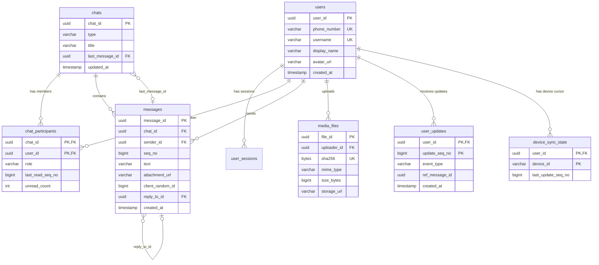
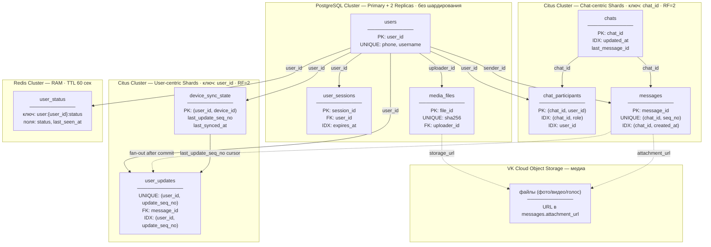
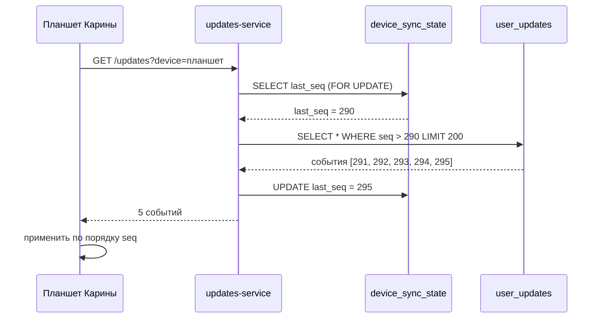
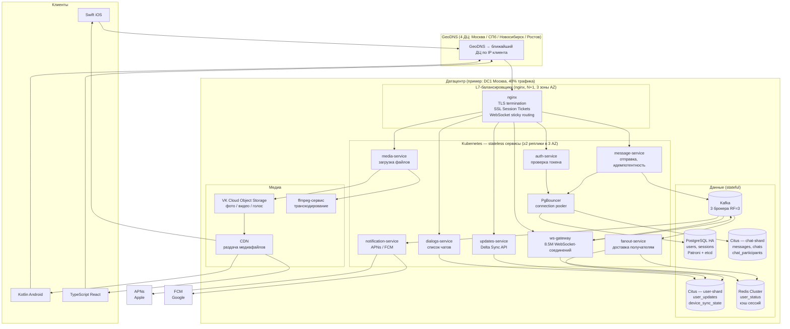
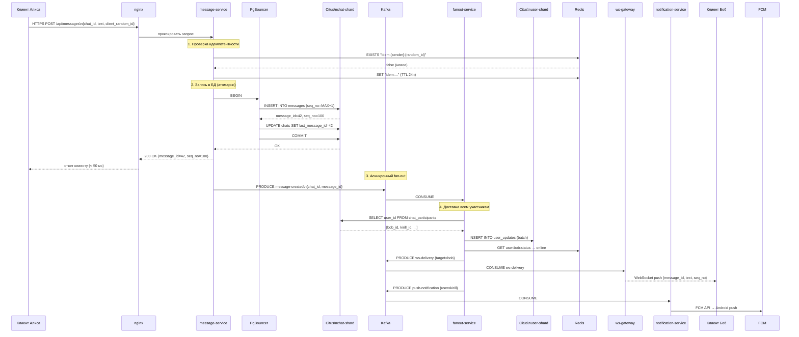
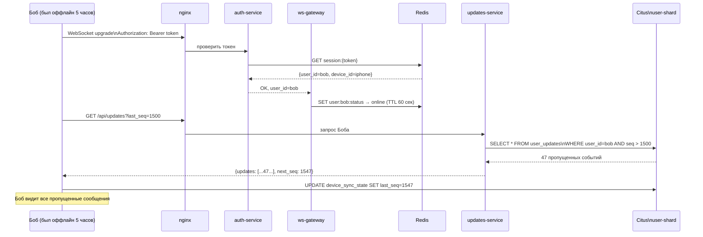
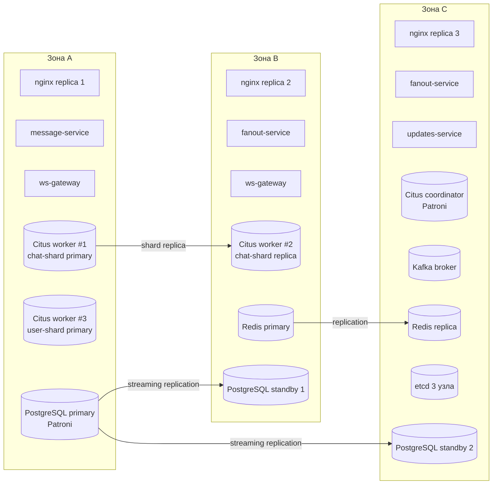

# Проектирование высоконагруженных систем: Мессенджер MAX

## Содержание

1. [Тема и целевая аудитория](#1-тема-и-целевая-аудитория)
   - 1.1. [Основные функции MVP](#11-основные-функции-mvp)
   - 1.2. [Аудитория и конкуренты](#12-аудитория-и-конкуренты)
   - 1.3. [Демография MAX](#13-демография-max)
   - 1.4. [Целевая аудитория: распределение по регионам](#14-целевая-аудитория-распределение-по-регионам)
   - 1.5. [Список литературы](#15-список-литературы)
2. [Расчёт нагрузки](#2-расчёт-нагрузки)
   - 2.1. [Продуктовые метрики](#21-продуктовые-метрики)
   - 2.2. [Размер одного сообщения](#22-размер-одного-сообщения-побайтово)
   - 2.3. [Расчёт RPS — откуда берутся 4 типа запросов](#23-расчёт-rps--откуда-берутся-4-типа-запросов)
   - 2.4. [Сетевой overhead и пропускная способность](#24-сетевой-overhead-и-пропускная-способность)
   - 2.5. [Расчёт хранилища](#25-расчёт-хранилища)
   - 2.6. [Список литературы](#26-список-литературы)
3. [Глобальная балансировка нагрузки](#3-глобальная-балансировка-нагрузки)
   - 3.1. [Функциональное разбиение по доменам](#31-функциональное-разбиение-по-доменам)
   - 3.2. [Расположение датацентров](#32-расположение-датацентров)
   - 3.3. [Распределение запросов по ДЦ](#33-распределение-запросов-по-дц)
   - 3.4. [GeoDNS vs Anycast — выбор технологии](#34-geodns-vs-anycast--выбор-технологии)
   - 3.5. [Схема DNS-балансировки и Failover](#35-схема-dns-балансировки-и-failover)
   - 3.6. [Список литературы](#36-список-литературы)
4. [Локальная балансировка нагрузки](#4-локальная-балансировка-нагрузки)
   - 4.1. [Механизм резервирования N+1](#41-механизм-резервирования-n1)
   - 4.2. [Расчёт количества L7-балансировщиков](#42-расчёт-количества-l7-балансировщиков)
   - 4.3. [SSL Session Tickets и WebSocket Sticky Routing](#43-ssl-session-tickets-и-websocket-sticky-routing)
   - 4.4. [Список литературы](#44-список-литературы)
5. [Логическая схема БД](#5-логическая-схема-бд)
   - 5.1. [Описание таблиц](#51-описание-таблиц--зачем-каждая-нужна)
   - 5.2. [Связи между таблицами (FK) и ER-диаграмма](#52-связи-между-таблицами-fk-и-er-диаграмма)
   - 5.3. [Сценарий: как работают user\_updates и device\_sync\_state](#53-сценарий-как-работают-user_updates-и-device_sync_state)
   - 5.4. [Индексы](#54-индексы)
   - 5.5. [Нагрузка на чтение и запись](#55-нагрузка-на-чтение-и-запись)
   - 5.6. [Требования к консистентности](#56-требования-к-консистентности)
   - 5.7. [Распределение нагрузки по ключам](#57-распределение-нагрузки-по-ключам)
   - 5.8. [Список литературы](#58-список-литературы)
6. [Физическая схема БД](#6-физическая-схема-бд)
   - [Обзор: кластеры и проекции](#обзор-кластеры-и-проекции)
   - 6.1. [Зачем разные СУБД](#61-зачем-разные-субд)
   - 6.2. [Выбор СУБД по таблицам](#62-выбор-субд-по-таблицам)
   - 6.3. [Расчёт Citus-воркеров](#63-расчёт-citus-воркеров)
   - 6.4. [Денормализация](#64-денормализация)
   - 6.5. [Шардирование](#65-шардирование)
   - 6.6. [API-маппинг на физические объекты](#66-api-маппинг-на-физические-объекты)
   - 6.7. [Список литературы](#67-список-литературы)
7. [Алгоритмы](#7-алгоритмы)
   - 7.1. [Fan-out](#71-fan-out--как-одно-сообщение-доходит-до-всех-участников)
   - 7.2. [Delta Synchronization](#72-delta-synchronization--как-устройство-узнаёт-что-пропустило)
   - 7.3. [Ordered Merge](#73-ordered-merge--как-отображать-сообщения-в-правильном-порядке)
   - 7.4. [Идемпотентность через random\_id](#74-идемпотентность-через-random_id)
   - 7.5. [Reconnect Storm: exponential backoff + jitter](#75-reconnect-storm-exponential-backoff--jitter)
   - 7.6. [WebSocket Keepalive](#76-websocket-keepalive)
   - 7.7. [Kafka: буфер, не блокер](#77-kafka-буфер-не-блокер)
   - 7.8. [Список литературы](#78-список-литературы)
8. [Технологии](#8-технологии)
   - 8.1. [Клиентские приложения](#клиентские-приложения)
   - 8.2. [Backend](#backend)
   - 8.3. [Базы данных](#базы-данных)
   - 8.4. [Object Storage и CDN (медиа)](#object-storage-и-cdn-медиа)
   - 8.5. [Инфраструктура](#инфраструктура)
   - 8.6. [Мониторинг, логи и трассировка](#мониторинг-логи-и-трассировка)
   - 8.7. [Тестирование](#тестирование)
   - 8.8. [Список литературы](#88-список-литературы)
9. [Обеспечение надёжности](#9-обеспечение-надёжности)
   - 9.1. [Резервирование компонентов](#91-резервирование-компонентов)
   - 9.2. [Сценарии graceful degradation](#92-сценарии-graceful-degradation)
   - 9.3. [Список литературы](#93-список-литературы)
10. [Схема проекта](#10-схема-проекта)
    - 10.1. [Полная архитектура системы](#101-полная-архитектура-системы)
    - 10.2. [Write Path — путь сообщения](#102-write-path--путь-сообщения)
    - 10.3. [Reconnect Path — синхронизация после офлайна](#103-reconnect-path--синхронизация-после-офлайна)
    - 10.4. [Раскладка по зонам доступности (AZ)](#104-раскладка-по-зонам-доступности-az)
    - 10.5. [Описание компонентов](#105-описание-компонентов)
    - 10.6. [Список литературы](#106-список-литературы)
11. [Список серверов](#11-список-серверов)
    - 11.1. [Нормативы для расчёта ресурсов](#111-нормативы-для-расчёта-ресурсов)
    - 11.2. [Формула расчёта](#112-формула-расчёта)
    - 11.3. [Расчёт ресурсов по сервисам (DC1 — Москва, 40% трафика)](#113-расчёт-ресурсов-по-сервисам-dc1--москва-40-трафика)
    - 11.4. [Таблица серверов (DC1 Москва, 40% трафика)](#114-таблица-серверов-dc1-москва-40-трафика)
    - 11.5. [Список литературы](#115-список-литературы)

---

## 1. Тема и целевая аудитория

**Мессенджер MAX** — сервис обмена сообщениями внутри экосистемы VK, позволяющий пользователям общаться в личных и групповых чатах в реальном времени. Запущен в марте 2025 года, к апрелю 2026 стал мессенджером №1 в России по суточному охвату.[\[1\]](#источники-1-1)

### 1.1. Основные функции MVP

1. Регистрация и авторизация по номеру телефона
2. Список диалогов
3. Отправка текстовых сообщений в реальном времени
4. **Отправка фото, голосовых сообщений и файлов**
5. Групповые чаты
6. Push-уведомления о новых сообщениях
7. Реакции на сообщения

### 1.2. Аудитория и конкуренты

| Мессенджер | MAU | DAU | Позиция в России (апрель 2026) |
|-----------|-----|-----|-------------------------------|
| WhatsApp | 3.3 млрд[\[2\]](#источники-1-2) | 2.3 млрд[\[2\]](#источники-1-2) | 2-е место (DAU 30.3 млн) |
| Telegram | 1.05 млрд[\[3\]](#источники-1-3) | 500 млн[\[3\]](#источники-1-3) | 3-е место (DAU 29.8 млн) |
| **MAX** | **85.4 млн (РФ)**[\[1\]](#источники-1-1) | **68 млн (РФ)**[\[1\]](#источники-1-1) | **1-е место** по суточному охвату |

Источник позиций: Mediascope, апрель 2026 ([\[1\]](#источники-1-1) — Ctrl+F: *"Whatsapp (30,3 млн)"*, *"до 29,8 млн человек"*, *"Max (85,4 млн)"*).

### 1.3. Демография MAX

| Платформа | Доля | Источник |
|----------|------|---------|
| Android | **73%** | [\[4\]](#источники-1-4) — Ctrl+F: *"Android приходится 73%"* |
| iOS | **26%** | тот же источник |
| Desktop | **1%** | тот же источник |

Возрастное ядро: **25–44 лет** (оценочно; официальные демографические данные VK не публиковались).

### 1.4. Целевая аудитория: распределение по регионам

| ДЦ | Регион (ФО) | Доля |
|----|------------|------|
| DC1 Москва | ЦФО + ПФО | **40%** |
| DC2 Санкт-Петербург | СЗФО | **25%** |
| DC3 Новосибирск | УФО + СФО + ДВФО | **20%** |
| DC4 Ростов-на-Дону | ЮФО + СКФО | **15%** |

Источник долей: Росстат, население по федеральным округам ([\[5\]](#источники-1-5) — раздел «Население по федеральным округам»; суммируй ФО и вычисли доли).

### 1.5. Список литературы

<a id="источники-1-1"></a>
**1.** [vedomosti.ru, 19.05.2026](https://www.vedomosti.ru/media/articles/2026/05/19/1198292-max-v-aprele-stal) (Ctrl+F: *"Max (85,4 млн человек)"*, *"в среднем в сутки заходило 68 млн россиян"*, *"Whatsapp (30,3 млн)"*, *"до 29,8 млн человек"*) — MAU/DAU MAX, позиции в рейтинге

<a id="источники-1-2"></a>
**2.** [infobip.com — WhatsApp Statistics](https://www.infobip.com/blog/whatsapp-statistics) (Ctrl+F: *"3.3 billion monthly"*, *"2.3 billion daily"*)

<a id="источники-1-3"></a>
**3.** [demandsage.com — Telegram Statistics](https://www.demandsage.com/telegram-statistics/) (Ctrl+F: *"1 billion monthly"*, *"500 million daily"*)

<a id="источники-1-4"></a>
**4.** [www1.ru, март 2026](https://www1.ru/news/2026/03/29/za-odin-god-v-messendzere-max-zaregistrirovalis-107-millionov-polzovatelei-sredi-nix-est-inostrancy.html) (Ctrl+F: *"На мобильную операционную систему Android приходится 73%"*)

<a id="источники-1-5"></a>
**5.** [Росстат — Население по федеральным округам](https://rosstat.gov.ru/bgd/regl/b21_14p/Main.htm) (раздел «Население по федеральным округам»; суммируй ФО и вычисли доли 40/25/20/15%)

---

## 2. Расчёт нагрузки

### 2.1. Продуктовые метрики

| Метрика | Значение | Источник / Обоснование |
|---------|----------|----------------------|
| **MAU** (Россия) | **85.4 млн** | Mediascope, апрель 2026 ([\[1\]](#источники-1-1) — Ctrl+F: *"Max (85,4 млн человек)"*) |
| **DAU** (Россия) | **68 млн** | Mediascope, апрель 2026 (тот же источник — Ctrl+F: *"в среднем в сутки заходило 68 млн"*) |
| **DAU/MAU** (вовлечённость) | **80%** | 68 / 85.4 = 79.6% |
| **DMS** (сообщений/день) | **1.5 млрд** | Официальный пресс-релиз VK ([\[1\]](#источники-2-1) — Ctrl+F: *"пользователи отправляют более 1,5 миллиардов сообщений"*) |
| **DMS/DAU** (сообщений на пользователя в день) | **22.1** | 1 500 000 000 / 68 000 000 |
| **Fan-out** (получателей на 1 сообщение) | **3.0** | 49% трафика в группах ([\[2\]](#источники-2-2)); avg группа MAX = **6** чел. (оценка, см. ниже) → 0.51×1 + 0.49×(6–1) = **2.96 ≈ 3.0** |
| **DMR** (доставок/день) | **4.5 млрд** | 1 500 000 000 × 3.0 |
| **DSU** (открытий приложения/день/пользователь) | **21** | По аналогии с Telegram: Павел Дуров, март 2025 ([\[3\]](#источники-2-3) — Ctrl+F: *"21 раз в день"*); данных MAX нет |
| **Пиковый коэффициент (k_peak)** | **4** | Научная статья ([\[4\]](#источники-2-4) — открой статью, найди Fig. 5a: пик ≈7% в 21:00, минимум ≈1.5% в 04:00 → 7÷1.5 ≈ 4.7, принимаем 4) |

> **Fan-out** — среднее количество человек, которым доставляется одно отправленное сообщение. Личный чат: fan-out = 1. Группа из 6 человек: fan-out = 5 (отправитель не получает своё сообщение).
>
> **Откуда avg группа MAX = 6** (данных MAX нет — инженерная оценка):
>
> 1. **База WhatsApp:** средний размер группы = **27** участников — [\[10\]](#источники-2-10) (Ctrl+F: *"27 members"*); подтверждение: [\[2\]](#источники-2-2) (Ctrl+F: *"27 members"*). Это вторичная статистика, не отчёт Meta.
> 2. **Доля группового трафика:** 41–57.5% сообщений WhatsApp идёт из групп ([\[2\]](#источники-2-2) — Ctrl+F: *"41-57.5% of total message volume originates from group chats"*); медиана = **49%**, личные чаты = **51%**.
> 3. **Пропорция по глобальному DAU** (√-масштаб, α = 0.5): WhatsApp DAU = **2.3 млрд** ([\[2\]](#источники-2-2)), MAX DAU = **85 млн** глобально ([\[11\]](#источники-2-11)):
>    ```
>    avg_group_MAX = 27 × √(85M / 2300M) = 27 × √0.037 ≈ 27 × 0.19 ≈ 5.2
>    ```
>    Линейное масштабирование (27 × 0.037 ≈ 1) нереалистично; √-масштаб — допущение: размер группы растёт медленнее аудитории.
> 4. **Принято 6** — округление 5.2 вверх (консервативная оценка для нагрузки).
> 5. **Fan-out:** `0.51 × 1 + 0.49 × (6 − 1) = 0.51 + 2.45 = 2.96 ≈ 3.0`.
>
> **k_peak** — коэффициент вечернего пика. Вечером (21:00) нагрузка в 4 раза выше среднесуточной.

### 2.2. Размер одного сообщения (побайтово)

Чтобы корректно считать трафик и хранилище — нужно знать размер строки в БД.

| Поле | Тип | Байт | Пояснение |
|------|-----|------|-----------|
| `message_id` | UUID | 16 | Уникальный ID (128 бит = 16 байт) |
| `chat_id` | UUID | 16 | В каком чате |
| `sender_id` | bigint | 8 | Кто отправил |
| `seq_no` | bigint | 8 | Порядковый номер в чате |
| `created_at` | timestamp | 8 | Время отправки |
| `text` | varchar | **544** | 136 символов × 4 байта (UTF-8, кириллица + emoji) |
| `attachment_url` | varchar | 100 | URL медиафайла, nullable |
| `reply_to_id` | UUID | 16 | На какое сообщение ответ |
| `client_random_id` | bigint | 8 | ID для идемпотентности (nullable) |
| `edited_at` | timestamp | 8 | Когда редактировали |
| **Итого** | | **~732 байта** → **768 Б** | (с выравниванием PostgreSQL) |

> **136 символов** — консервативная оценка длины (75-й перцентиль по научным данным о реальных сообщениях).

### 2.3. Расчёт RPS — откуда берутся 4 типа запросов

#### Endpoint 1: `POST /messages/send` — отправка сообщения

**Нагрузка** = DMS ÷ 86 400 = 1 500 000 000 ÷ 86 400 = **17 361 avg RPS**

Каждый раз когда пользователь нажимает «Отправить» — один запрос. 1.5 млрд сообщений/день — официальные данные VK ([\[1\]](#источники-2-1) — Ctrl+F: *"1,5 миллиардов сообщений"*).

#### Endpoint 2: Доставка сообщений (WebSocket push — внутренняя)

**Нагрузка** = DMR ÷ 86 400 = 4 500 000 000 ÷ 86 400 = **52 083 avg RPS**

Это не отдельный API-запрос от клиента — сервер сам проталкивает сообщение через открытый WebSocket. Нагрузка = DMS × fan-out, потому что одно сообщение нужно доставить 3.0 получателям в среднем.

#### Endpoint 3: `GET /updates` — синхронизация при открытии приложения

**Нагрузка** = DAU × DSU ÷ 86 400 = 68 000 000 × 21 ÷ 86 400 = **16 528 avg RPS**

При каждом открытии приложения телефон спрашивает «что я пропустил?». Сервер отвечает дельтой — только новыми событиями. Этот тип запроса описан в Telegram API как `updates.getDifference` ([\[8\]](#источники-2-8) — Ctrl+F: *"getDifference"*: метод возвращает всё пропущенное с заданной точки).

**DSU = 21** — по аналогии с Telegram. Данных MAX нет.

#### Endpoint 4: `GET /messages/history` — загрузка истории чата

**Нагрузка** = DAU × DSU × 2 ÷ 86 400 = 68 000 000 × 21 × 2 ÷ 86 400 = **33 056 avg RPS**

Когда пользователь открывает конкретный чат — загружает последние 50 сообщений. Множитель 2 = за одну сессию открывается в среднем 2 разных чата (минимально реалистичное допущение).

#### Итоговая таблица RPS

| Запрос | Формула | Avg RPS | Peak RPS (×4) |
|--------|---------|---------|--------------|
| `POST /messages/send` | 1 500 000 000 ÷ 86 400 | **17 361** | **69 444** |
| Доставка (WebSocket push) | 4 500 000 000 ÷ 86 400 | **52 083** | **208 333** |
| `GET /updates` | 68M × 21 ÷ 86 400 | **16 528** | **66 111** |
| `GET /messages/history` | 68M × 21 × 2 ÷ 86 400 | **33 056** | **132 222** |
| **Суммарный пиковый RPS** | | | **441 388** |

> **RPS** = Requests Per Second — запросов к серверу в секунду. Avg — в среднем за сутки. Peak — максимум в вечерние часы (×k_peak=4).

### 2.4. Сетевой overhead и пропускная способность

**Сетевой overhead** — это служебные байты, которые протоколы добавляют к каждому сообщению:

```
Текст сообщения (544 байта)
+ Метаданные: ID, чат, отправитель, время (120 байт)
+ WebSocket заголовок (RFC 6455[\[9\]](#источники-2-9)): 4–8 байт
+ TLS запись (RFC 8446[\[6\]](#источники-2-6)): 22 байта (5-байт заголовок + 16-байт AES-GCM тег + 1 тип)
+ TCP заголовок (RFC 6691[\[5\]](#источники-2-5)): 20 байт
+ IP заголовок: 20 байт
─────────────────────────────────────────────
Итого: ~730 байт на доставку / ~734 байта на отправку
```

Источники: RFC 6691 (TCP, [\[5\]](#источники-2-5)), RFC 8446 (TLS 1.3, [\[6\]](#источники-2-6)), RFC 6455 (WebSocket, [\[9\]](#источники-2-9)).

**Пропускная способность (Bandwidth):**

```
Отправка (avg): 17 361 × 734 байта × 8 бит ÷ 10⁹ = 0.102 Гбит/с
Отправка (peak ×4):                                 = 0.408 Гбит/с

Доставка текста (avg): 52 083 × 730 байт × 8 ÷ 10⁹ = 0.304 Гбит/с
Доставка текста (peak ×4):                           = 1.016 Гбит/с

Загрузка медиа (avg):  3 472 × 500 000 × 8 ÷ 10⁹   = 13.9 Гбит/с
Загрузка медиа (peak ×4):                            = 55.5 Гбит/с

Скачивание медиа через CDN (avg): 3 472 × 3.0 × 500K × 8 ÷ 10⁹ = 41.7 Гбит/с
Скачивание медиа (peak ×4):                                       = 166.7 Гбит/с
```

> Медиатрафик (~167 Гбит/с peak) в **100×** превышает текстовый (~1.4 Гбит/с). Именно поэтому медиа раздаётся через CDN, а не напрямую из датацентра.

### 2.5. Расчёт хранилища

**Доля медиасообщений** — 20% (по аналогии с WhatsApp: [\[2\]](#источники-2-2) — Ctrl+F: *"20% of messages include media"*). Данных MAX нет.

**Средний размер медиафайла** — ~500 КБ после сжатия на клиенте ([\[7\]](#источники-2-7) — Ctrl+F: *"Average media size: 500 KB after client-side compression"*).

```
Медиасообщений/день: 1 500 000 000 × 20% = 300 000 000
Media RPS upload avg: 300 000 000 ÷ 86 400 = 3 472 RPS
Media RPS upload peak: 3 472 × 4 = 13 889 RPS

Медиахранилище/день: 300 000 000 × 500 КБ = 150 ТБ/день
```

**Итоговая таблица хранилища за год:**

| Тип данных | Размер/день | За год (сырые) | С репликацией ×3 | Где хранится |
|-----------|------------|----------------|-----------------|-------------|
| Текстовые сообщения (`messages`) | 1.13 ТБ | ~412 ТБ | **~1.21 ПБ** | Citus (PostgreSQL) |
| Метаданные медиа (`media_files`, 256 Б × 300M) | 77 ГБ | ~28 ТБ | ~84 ТБ | PostgreSQL |
| Медиафайлы (фото/видео/голос) | 150 ТБ | ~53.5 ПБ | **~160 ПБ** | Object Storage |
| **Итого** | **~151 ТБ** | **~54 ПБ** | **~161 ПБ** | |

> Медиа занимает **99% всего хранилища** — именно поэтому медиа хранят в отдельном object storage (S3-совместимом), а не в основной БД.
>
> **Три копии** = стандарт надёжности: основная + два резервных сервера. Один сломается — данные не потеряются.

### 2.6. Список литературы

<a id="источники-2-1"></a>
**1.** [vk.company, 26.03.2026](https://vk.company/ru/press/releases/12267/) (Ctrl+F: *"1,5 миллиардов сообщений"*) — DMS=1.5B

<a id="источники-2-2"></a>
**2.** [infobip.com — WhatsApp Statistics](https://www.infobip.com/blog/whatsapp-statistics) (Ctrl+F: *"41-57.5% of total message volume originates from group chats"*, *"27 members"*, *"2.3 billion daily"*, *"20% of messages include media"*)

<a id="источники-2-3"></a>
**3.** [govoritmoskva.ru, март 2025](https://govoritmoskva.ru/news/445725/) (Ctrl+F: *"21 раз в день"*) — DSU=21 (по аналогии с Telegram)

<a id="источники-2-4"></a>
**4.** [nature.com](https://www.nature.com/articles/s41599-022-01161-0) (Fig. 5a: пик ≈7% в 21:00, минимум ≈1.5% в 04:00) — k_peak=4

<a id="источники-2-5"></a>
**5.** [RFC 6691](https://www.rfc-editor.org/rfc/rfc6691.html) / [RFC 793](https://datatracker.ietf.org/doc/html/rfc793) (Ctrl+F: *"TCP segment header is 20 bytes"*, *"minimum IP header size of 20"*)

<a id="источники-2-6"></a>
**6.** [RFC 8446 — TLS 1.3](https://datatracker.ietf.org/doc/html/rfc8446) (Ctrl+F: *"record layer"*) — 22 байта overhead

<a id="источники-2-7"></a>
**7.** [nskillhub.com](https://nskillhub.com/system-design/classic/whatsapp-chat-messaging/) (Ctrl+F: *"Average media size: 500 KB after client-side compression"*)

<a id="источники-2-8"></a>
**8.** [core.telegram.org/api/updates](https://core.telegram.org/api/updates) (Ctrl+F: *"getDifference"*) — метод Delta Sync

<a id="источники-2-9"></a>
**9.** [RFC 6455 — WebSocket](https://datatracker.ietf.org/doc/html/rfc6455) (Ctrl+F: *"masking key"*) — заголовок фрейма 4–8 байт

<a id="источники-2-10"></a>
**10.** [sqmagazine.co.uk — WhatsApp Statistics](https://sqmagazine.co.uk/whatsapp-statistics/) (Ctrl+F: *"27 members"*) — средний размер группы WhatsApp

<a id="источники-2-11"></a>
**11.** [1prime.ru, 06.05.2026](https://1prime.ru/20260506/maks-869714354.html) (Ctrl+F: *"Ежедневная аудитория онлайн-платформы «Макс» превысила 85 миллионов"*) — MAX DAU глобально

---

## 3. Глобальная балансировка нагрузки

### Объяснение терминов

**Датацентр (ДЦ)** — здание с серверами. У MAX их 4: Москва, Санкт-Петербург, Новосибирск, Ростов-на-Дону ([\[2\]](#источники-3-2), [\[3\]](#источники-3-3)).

**GeoDNS** — DNS с геомаршрутизацией: resolver определяет регион клиента по IP и возвращает A-запись ближайшего ДЦ ([\[4\]](#источники-3-4)). Пользователь из Новосибирска получает IP DC3, а не DC1.

**Anycast** — один IP объявляется из нескольких точек через BGP; маршрутизаторы направляют трафик на топологически ближайший узел. Требует собственного AS-номера и координации BGP с каждым ДЦ ([\[5\]](#источники-3-5)).

**Failover** — переключение трафика на резервный ДЦ при недоступности основного. Скорость ограничена DNS TTL и кэшем resolver'ов ([\[5\]](#источники-3-5) — типично 20–60 сек в production).

**TTL (Time To Live)** — время жизни DNS-ответа в кэше. TTL=60 сек → после сбоя ДЦ клиенты получат новый IP не позднее чем через 60 сек (плюс время health-check).

### 3.1. Функциональное разбиение по доменам

| Домен | Функции |
|-------|---------|
| `auth.max.ru` | Аутентификация, регистрация, сессии |
| `msg.max.ru` | Отправка/приём сообщений, WebSocket |
| `media.max.ru` | Загрузка и скачивание медиафайлов |
| `api.max.ru` | Диалоги, история, обновления |

Разделение по поддоменам позволяет независимо масштабировать CPU (`msg.`) и storage/CDN (`media.`) — декомпозиция highload-сервиса по функциональным границам ([\[6\]](#источники-3-6)).

### 3.2. Расположение датацентров

| ДЦ | Город | Площадка / провайдер | Цель |
|----|-------|---------------------|------|
| DC1 | Москва | Selectel, зона MSK ([\[2\]](#источники-3-2)) | ЦФО + ПФО — 40% населения ([\[1\]](#источники-3-1)) |
| DC2 | Санкт-Петербург | Selectel, зона SPB ([\[2\]](#источники-3-2)) | СЗФО — 25% |
| DC3 | Новосибирск | Selectel, зона NSK ([\[2\]](#источники-3-2)) | УФО + СФО + ДВФО — 20% |
| DC4 | Ростов-на-Дону | Colocation (Ростелеком и др.) ([\[3\]](#источники-3-3)) | ЮФО + СКФО — 15% |

> **Почему DC3 (Новосибирск) обязателен:** Россия — 11 часовых поясов; расстояние Москва — Владивосток > 6 000 км ([\[7\]](#источники-3-7)). RTT до Москвы с Дальнего Востока — **120–160 мс** (измерения MTS Speedtest: Kemerovo→Vladivostok 154 мс — [\[8\]](#источники-3-8)). DC3 сокращает путь для Сибири: Kemerovo→Novosibirsk ≈ **101 мс** ([\[8\]](#источники-3-8)) — экономия **30–50%** RTT vs маршрутизация всего трафика в Москву.

> **Почему DC4 (Ростов):** Selectel не имеет площадки на юге РФ ([\[2\]](#источники-3-2)); для ЮФО + СКФО (15% населения) — colocation у регионального оператора, аналогично edge-узлу Ростелеком в Ростове ([\[3\]](#источники-3-3)).

### 3.3. Распределение запросов по ДЦ

Суммарный пиковый RPS = 69 444 + 208 333 + 66 111 + 132 222 = **441 388 peak RPS** (из §2.3)

Доли трафика = доли населения по группам ФО (§1.4):

| Группа ФО | Федеральные округа | Доля населения | ДЦ |
|-----------|-------------------|----------------|-----|
| ЦФО + ПФО | Центральный, Приволжский | **40%** | DC1 |
| СЗФО | Северо-Западный | **25%** | DC2 |
| УФО + СФО + ДВФО | Уральский, Сибирский, Дальневосточный | **20%** | DC3 |
| ЮФО + СКФО | Южный, Северо-Кавказский | **15%** | DC4 |

| ДЦ | Доля | Peak RPS | Источник долей |
|----|------|---------|---------------|
| DC1 Москва | 40% | **176 555** | [\[1\]](#источники-3-1) — ЦФО + ПФО |
| DC2 Санкт-Петербург | 25% | **110 347** | [\[1\]](#источники-3-1) — СЗФО |
| DC3 Новосибирск | 20% | **88 278** | [\[1\]](#источники-3-1) — УФО + СФО + ДВФО |
| DC4 Ростов | 15% | **66 208** | [\[1\]](#источники-3-1) — ЮФО + СКФО |
| **Итого** | 100% | **441 388** | |

### 3.4. GeoDNS vs Anycast — выбор технологии

**Выбор: GeoDNS**, потому что:

| Критерий | GeoDNS | Anycast |
|----------|--------|---------|
| Требования | DNS-провайдер с geo-routing (Yandex Cloud DNS, NS1) | Собственный AS + BGP на каждой площадке |
| Сложность | Низкая — правила через API ([\[4\]](#источники-3-4)) | Высокая — LOA, colocation в IX, BGP-экспертиза ([\[5\]](#источники-3-5)) |
| Стоимость | Умеренная (managed DNS) | Высокая (свой AS, /24 IPv4 блок) |
| Точность маршрутизации | По GeoIP клиента / ECS | По BGP-топологии, не по границам ФО |
| Failover | 20–60 сек (DNS TTL + кэш resolver) | Sub-second на edge, сложнее в эксплуатации |
| **Вывод** | **Подходит** для 4 ДЦ в РФ | **Избыточно** на текущем масштабе |

GeoDNS решает задачу: ЦФО → DC1, СЗФО → DC2, Сибирь → DC3, Юг → DC4 — без владения BGP-инфраструктурой ([\[4\]](#источники-3-4), [\[5\]](#источники-3-5)).

### 3.5. Схема DNS-балансировки и Failover

**Как работает GeoDNS** ([\[4\]](#источники-3-4)):
- Resolver определяет регион клиента по GeoIP (и EDNS Client Subnet, если поддерживается)
- Возвращает A-запись ближайшего healthy ДЦ
- Health-check каждые **15 сек**: TCP connect + `HTTP GET /health` ([\[9\]](#источники-3-9))
- TTL A-записи = **60 сек** ([\[5\]](#источники-3-5) — production-диапазон 20–60 сек)

**Failover-таблица:**

| Ломается | Куда уходит трафик | За сколько | Последствия |
|---------|-------------------|-----------|-------------|
| DC4 (Ростов) | DC1 (Москва) | ≤ 60 сек (TTL) | Рост latency для юга на ~20–40 мс |
| DC3 (Новосибирск) | DC1 (Москва) | ≤ 60 сек | RTT для Сибири/ДВ +80–100 мс ([\[7\]](#источники-3-7), [\[8\]](#источники-3-8)) |
| DC2 (СПб) | DC1 (Москва) | ≤ 60 сек | Минимально — МСК↔СПб ~10–15 мс ([\[10\]](#источники-3-10)) |
| DC1 (Москва) | DC2 + DC3 + DC4 | ≤ 60 сек | Peak RPS перераспределяется; нужен запас мощности в резервных ДЦ |

> **Почему TTL = 60 сек:** компромисс между скоростью failover и нагрузкой на DNS. Ниже 30 сек — рост query volume без пропорционального выигрыша ([\[5\]](#источники-3-5)); выше 60 сек — слишком долгое переключение при аварии.

**Схема DNS-балансировки (текстовая):**

```
Пользователь (Новосибирск)
       │
       ▼
GeoDNS (Yandex Cloud DNS / NS1 — geo-routing по IP)
       │ A-запись: VIP DC3 Новосибирск
       ▼
L4-балансировщик DC3 (Selectel Load Balancer, Virtual IP)
       │ распределение по L7-пулу
       ▼
nginx L7 (пул из 9–10 серверов, N+1)
       │ TLS Termination + маршрутизация по домену
       ▼
userver-сервисы (auth, message, updates, ws-gateway...)
```

### 3.6. Список литературы

<a id="источники-3-1"></a>
**1.** [Росстат — Население по федеральным округам](https://rosstat.gov.ru/bgd/regl/b21_14p/Main.htm) (раздел «Население по федеральным округам»; суммируй ФО → доли 40/25/20/15%) — распределение трафика по ДЦ

<a id="источники-3-2"></a>
**2.** [Selectel — Локации дата-центров](https://docs.selectel.ru/infrastructure/locations/) (Ctrl+F: *"Москва"*, *"Санкт-Петербург"*, *"Новосибирск"*) — DC1/DC2/DC3

<a id="источники-3-3"></a>
**3.** [news.mail.ru — Ростелеком, ЦОД в Ростове-на-Дону](https://news.mail.ru/society/71131403/) (Ctrl+F: *"ЦОД"*, *"Ростове-на-Дону"*, *"южных регионах"*) — обоснование DC4

<a id="источники-3-4"></a>
**4.** [Yandex Cloud — DNS, геомаршрутизация](https://yandex.cloud/ru/docs/dns/concepts/geohealth) (Ctrl+F: *"географ"*) — GeoDNS, health-checks, geo-routing

<a id="источники-3-5"></a>
**5.** [System Overflow — DNS GSLB vs Anycast](https://www.systemoverflow.com/learn/load-balancing/global-load-balancing/dns-based-gslb-vs-anycast-edge-proxy) (Ctrl+F: *"TTL"*, *"20-60 seconds"*, *"BGP"*) — выбор GeoDNS vs Anycast, TTL failover

<a id="источники-3-6"></a>
**6.** [ByteByteGo — Design a Chat System](https://bytebytego.com/courses/system-design-interview/design-a-chat-system) — декомпозиция сервисов мессенджера по функциям

<a id="источники-3-7"></a>
**7.** [ServerMO — Russia Latency & Geo-Routing Guide](https://www.servermo.com/blogs/russia-latency-geo-routing-guide/) (Ctrl+F: *"6,000 km"*, *"150ms"*, *"Geo-DNS"*) — latency по часовым поясам РФ

<a id="источники-3-8"></a>
**8.** [Speedtest measurement — Kemerovo RTT matrix](https://result.nws.sh/r/1726589517_CS2RMK_RUSSIA.txt) (Ctrl+F: *"Vladivostok"*, *"Novosibirsk"*, *"Moscow"*) — измеренные RTT между городами РФ

<a id="источники-3-9"></a>
**9.** [Selectel — Load Balancer](https://docs.selectel.ru/load-balancer/about/about-load-balancer/) (Ctrl+F: *"health"*) — L4 health-check перед L7-пулом

<a id="источники-3-10"></a>
**10.** [Habr / Selectel — Магистральные сети РФ](https://habr.com/ru/companies/selectel/articles/319400/) — низкая latency между крупными городами (МСК↔СПб)

---

## 4. Локальная балансировка нагрузки

### Объяснение терминов

**L4/L7 балансировщик** — программа, распределяющая входящие соединения по серверам. L4 работает на уровне TCP (перенаправляет пакеты), L7 умеет читать HTTP/WebSocket (маршрутизирует по домену, пути, заголовкам).

**TLS Termination** — расшифровка HTTPS. Браузер шлёт зашифрованные данные → балансировщик расшифровывает и передаёт серверам внутри защищённой сети ДЦ. Операция нагружает CPU.

**SSL Session Tickets** — оптимизация: при первом соединении сервер выдаёт клиенту зашифрованный «билет». При следующем подключении — расшифровка быстрее (0-RTT). Снижает нагрузку на CPU при ~90% повторных подключений в 2–3 раза.

**WebSocket Sticky Routing** — WebSocket это долгосрочное соединение (часы). Нельзя переключать пользователя между серверами на каждый запрос. nginx настраивается: `hash $remote_addr consistent` — все пакеты одного WS-соединения идут на один backend.

### 4.1. Механизм резервирования N+1

**Два слоя балансировки внутри ДЦ:**

1. **L4-слой** — Virtual IP от провайдера ДЦ. Принимает TCP-поток, распределяет по L7-узлам через ECMP.
2. **L7-слой** — пул nginx. TLS termination, маршрутизация по доменам, sticky routing для WebSocket.

**Схема N+1**: N серверов обслуживают трафик, 1 горячий резерв принимает нагрузку при падении любого из N.

### 4.2. Расчёт количества L7-балансировщиков

**Производительность одного nginx (24 CPU):**
- По SSL: **10 274 HTTPS CPS** ([\[1\]](#источники-4-1) — Ctrl+F: *"10,274 HTTPS CPS"* в таблице результатов)
- По трафику: **8.80 Гбит/с** ([\[2\]](#источники-4-2) — Ctrl+F: *"8.80 Gbps"*)

**Формула:** N_ssl = ⌈Peak RPS ÷ 10 274⌉, N_net = ⌈Peak Gbit/s ÷ 8.80⌉, итого N = max(N_ssl, N_net) + 1 резерв.

**Узкое место — SSL**, не сеть: пиковый трафик ~1.4 Гбит/с (один сервер выдерживает 8.8 Гбит/с) vs SSL-расшифровка 441K RPS (нужно 43 сервера). CPU-bottleneck, а не сеть.

| ДЦ | Доля | Peak RPS | N_ssl | N_net | N рабочих | +1 резерв | **Итого** |
|----|------|---------|-------|-------|----------|----------|---------|
| DC1 Москва | 40% | 176 555 | ⌈176 555÷10 274⌉ = **18** | 1 | 18 | 1 | **19** |
| DC2 СПб | 25% | 110 347 | ⌈110 347÷10 274⌉ = **11** | 1 | 11 | 1 | **12** |
| DC3 Новосибирск | 20% | 88 278 | ⌈88 278÷10 274⌉ = **9** | 1 | 9 | 1 | **10** |
| DC4 Ростов | 15% | 66 208 | ⌈66 208÷10 274⌉ = **7** | 1 | 7 | 1 | **8** |
| **Итого** | | **441 388** | | | **45** | **4** | **49** |

### 4.3. SSL Session Tickets и WebSocket Sticky Routing

**SSL Session Tickets** (оптимизация TLS):
- При первом подключении сервер выдаёт клиенту зашифрованный «тикет» с параметрами сессии
- При следующем подключении клиент предъявляет тикет → TLS-рукопожатие занимает 0-RTT вместо 2-RTT
- Ключ тикета синхронизируется между nginx-репликами через shared memory (nginx session ticket key rotation)
- Снижает CPU-нагрузку на SSL при повторных подключениях в 2–3 раза (~90% reconnect в мессенджере)

**WebSocket Sticky Routing** (nginx конфигурация):
```nginx
upstream ws_backends {
    hash $remote_addr consistent;  # sticky routing по IP клиента
    server ws-gateway-1:8080;
    server ws-gateway-2:8080;
    server ws-gateway-3:8080;
}
```
Все пакеты одного WS-соединения всегда идут на один backend-сервер.

### 4.4. Список литературы

<a id="источники-4-1"></a>
**1.** [blog.nginx.org — HTTPS CPS](https://blog.nginx.org/blog/testing-the-performance-of-nginx-and-nginx-plus-web-servers) (Ctrl+F: *"10,274 HTTPS CPS"*, 24 CPU)

<a id="источники-4-2"></a>
**2.** [blog.nginx.org — Ingress throughput](https://blog.nginx.org/blog/testing-performance-nginx-ingress-controller-kubernetes) (Ctrl+F: *"8.80 Gbps"*, 24 CPU)

---

## 5. Логическая схема БД

### Паттерн схемы

Схема MAX построена на двух industry-паттернах:

1. **Telegram Cloud Chats** — серверная история сообщений, метаданные чата, ACL участников ([\[5\]](#источники-5-5) — Ctrl+F: *"Cloud chats"*).
2. **Fan-out + Delta Sync** — после записи сообщения сервер «разкладывает» его в персональный журнал каждого получателя; устройство догоняет пропущенное через курсор синхронизации ([\[3\]](#источники-5-3) — *"pts"*, *"getDifference"*; [\[6\]](#источники-5-6) — *"Iris"*).

**Откуда взяты имена таблиц** — краткая карта; подробнее у каждой таблицы в §5.1:

| Таблица | Паттерн | Источник |
|---------|---------|----------|
| `users` | Сущность **User** | [\[2\]](#источники-5-2) — chat system design; множественное число — SQL-конвенция |
| `user_sessions` | Сессии устройств отдельно от профиля | [\[2\]](#источники-5-2) — auth + push-токены на device |
| `chats`, `messages` | **Cloud Chats** — серверная история | [\[5\]](#источники-5-5) — Ctrl+F: *"Cloud chats"* |
| `chat_participants` | **ChatParticipant** в MTProto | [\[7\]](#источники-5-7) — `chatParticipant`, не generic «members» |
| `user_updates` | Персональный поток **Updates** | [\[3\]](#источники-5-3) — `pts`; [\[6\]](#источники-5-6) — Iris fan-out queue |
| `device_sync_state` | Курсор **getDifference** на устройство | [\[3\]](#источники-5-3) — `getDifference`, `pts` |
| `user_status` | **UserStatus** (online/offline) | [\[8\]](#источники-5-8) — `userStatusOnline`, `updateUserStatus` |
| `media_files` | Метаданные blob, dedup по hash | [\[4\]](#источники-5-4) — deduplication; файлы в object storage, не в PostgreSQL |

### 5.1. Описание таблиц — зачем каждая нужна

#### `users` — профиль пользователя

> **Почему такое имя:** Таблица профилей — множественное число `users` по SQL-конвенции (строка = один пользователь). Соответствует сущности **User** в схемах мессенджеров ([\[2\]](#источники-5-2)). Отдельно от сессий и статуса: профиль живёт годами, сессии и online/offline меняются постоянно.

Хранит кто ты — номер телефона, имя, аватар.

| Поле | Тип | Байт | Примечание |
|------|-----|------|------------|
| `user_id` | UUID | 16 | PK |
| `phone_number` | varchar | 16 | UNIQUE, первичный идентификатор |
| `username` | varchar | 24 | UNIQUE, опциональный |
| `display_name` | varchar | 32 | |
| `avatar_url` | varchar | 64 | Ссылка в object storage |
| `created_at`, `updated_at` | timestamp×2 | 16 | |
| **Итого** | | **168 Б → 256 Б** | (с выравниванием) |

Регистрация по номеру телефона — стандарт мессенджеров (Telegram, WhatsApp, MAX): верификация через SMS исключает ботов. `avatar_url` — ссылка на object storage, не сам файл (иначе строка была бы мегабайты).

#### `user_sessions` — сессия устройства + push-токен

> **Почему такое имя:** Префикс `user_` — FK на `users`; суффикс `_sessions` — не «логин», а **сессия конкретного устройства** (токен, push, IP). В Telegram API это близко к `authorization` / device binding; в SQL удобнее одна таблица «устройство ↔ пользователь» ([\[2\]](#источники-5-2)).

Один пользователь имеет несколько устройств (телефон + планшет + ПК). Каждое устройство = отдельная сессия. `push_token` (FCM/APNs) хранится здесь — при инвалидации сессии токен автоматически становится недействительным. Поддерживается до 5 одновременных сессий.

> **Почему `user_sessions` ≠ `user_status`:** Сессия = «токен действителен». UserStatus = «сейчас online/offline» ([\[8\]](#источники-5-8)). Пользователь мог закрыть приложение — сессия жива, статус offline.

| Поле | Тип | Байт |
|------|-----|------|
| `session_id` | UUID | 16 |
| `user_id` | UUID FK | 16 |
| `device_id` | varchar | 16 |
| `push_token` | varchar | 64 |
| `user_agent` | varchar | 64 |
| `ip` | varchar | 16 |
| `created_at`, `expires_at` | timestamp×2 | 16 |
| **Итого** | | **208 Б → 256 Б** |

#### `chats` — метаданные чата

> **Почему такое имя:** Имя из паттерна **Cloud Chats** Telegram ([\[5\]](#источники-5-5)): сервер хранит метаданные чата и историю, клиент синхронизирует дельту. `chats` — только «шапка» (тип, название, превью); текст сообщений — в `messages`. Множественное число: одна строка = один чат.

Описывает чат: тип (личный/группа), название, аватар.

**`last_message_id` — зачем он нужен?**

При открытии списка диалогов приложение показывает превью последнего сообщения. Без `last_message_id` — N запросов (по одному на каждый чат):

```sql
SELECT text, created_at FROM messages WHERE chat_id = ? ORDER BY seq_no DESC LIMIT 1
-- × N чатов = N запросов к БД
```

С `last_message_id` — один JOIN:

```sql
SELECT c.*, m.text, m.created_at
FROM   chats c
JOIN   messages m ON m.message_id = c.last_message_id
WHERE  c.chat_id IN (...мои чаты...)
```

Это **денормализация** — намеренное дублирование ради скорости. Обновляется атомарно с каждой записью сообщения. ([\[1\]](#источники-5-1) — Ctrl+F: *"last message preview"*)

> **`last_message_id` ≠ `user_updates`:** `last_message_id` — UI-оптимизация для отображения списка диалогов. `user_updates` — механизм доставки событий на устройства. Оба связаны с сообщениями, но используются в разных местах.

| Поле | Тип | Байт |
|------|-----|------|
| `chat_id` | UUID | 16 |
| `type` | varchar | 4 |
| `title` | varchar | 64 |
| `avatar_url` | varchar | 64 |
| `last_message_id` | UUID FK (nullable) | 16 |
| `created_at`, `updated_at` | timestamp×2 | 16 |
| **Итого** | | **180 Б → 192 Б** |

#### `chat_participants` — участники чата (ChatParticipant)

> **Почему такое имя:** В MTProto Telegram участник чата — тип **`ChatParticipant`** (`chatParticipant`, `chatParticipantAdmin` — [\[7\]](#источники-5-7)). Имя `participants` отражает API-термин, а не абстрактное `members`. Таблица = ACL чата: кто внутри, роль, прогресс чтения — нужна fan-out при отправке сообщения.

Many-to-many связь пользователей и чатов.

| Поле | Тип | Байт |
|------|-----|------|
| `chat_id` | UUID PK,FK | 16 |
| `user_id` | UUID PK,FK | 16 |
| `role` | varchar | 4 |
| `last_read_seq_no` | bigint | 8 |
| `unread_count` | int | 4 |
| `joined_at` | timestamp | 8 |
| **Итого** | | **56 Б → 64 Б** |

Fan-out читает участников отсюда. `last_read_seq_no` + `unread_count` — счётчик непрочитанных без дорогого `COUNT(*)`.

#### `messages` — история сообщений

> **Почему такое имя:** Стандартное имя для **chat-centric** хранилища в Cloud Chats ([\[5\]](#источники-5-5)): все сообщения одного чата лежат рядом по `chat_id`. Не `chat_messages` — контекст и так задаёт FK `chat_id`; короче в JOIN и индексах.

Основное содержимое мессенджера. `seq_no` — порядковый номер в рамках конкретного чата (не глобальный). Именно он используется в Delta Sync (клиент знает что у него seq_no до 1000 — просит прислать с 1001). `attachment_url` — nullable, ссылка в object storage. `client_random_id` — для идемпотентности (§7.4).

| Поле | Тип | Байт |
|------|-----|------|
| `message_id` | UUID | 16 |
| `chat_id` | UUID FK | 16 |
| `sender_id` | UUID FK | 16 |
| `seq_no` | bigint | 8 |
| `text` | varchar | 544 |
| `attachment_url` | varchar (nullable) | 100 |
| `client_random_id` | bigint (nullable) | 8 |
| `reply_to_id` | UUID (nullable) | 16 |
| `edited_at` | timestamp | 8 |
| `created_at` | timestamp | 8 |
| **Итого** | | **740 Б → 768 Б** |

#### `media_files` — метаданные медиафайлов

> **Почему такое имя:** MAX активно шлёт фото/видео; blob не кладём в `messages` — только ссылка. Отдельная таблица **`media_files`**: имя говорит, что здесь **метаданные файла** (hash, MIME, URL), а не строка чата. `files` — потому что в object storage лежит файл; `media_` — отличие от произвольных вложений документов. Dedup по `sha256` — как у WhatsApp ([\[4\]](#источники-5-4)).

При загрузке файла нужно: отслеживать статус, хранить хэш для дедупликации (одна картинка, пересланная 100 раз — одна запись в object storage), MIME-тип. Сами файлы — вне PostgreSQL, в object storage. В БД только 256 байт метаданных. ([\[4\]](#источники-5-4) — Ctrl+F: *"deduplication"*: WhatsApp делает то же самое)

| Поле | Тип | Байт |
|------|-----|------|
| `file_id` | UUID | 16 |
| `uploader_id` | bigint FK | 8 |
| `sha256` | bytes UNIQUE | 32 |
| `mime_type` | varchar | 32 |
| `size_bytes` | bigint | 8 |
| `storage_url` | varchar | 128 |
| `created_at` | timestamp | 8 |
| **Итого** | | **232 Б → 256 Б** |

#### `user_updates` — персональный журнал событий

> **Почему такое имя:** В Telegram клиент получает поток **Updates** с монотонным **`pts`** ([\[3\]](#источники-5-3)). После fan-out (Iris, Meta — [\[6\]](#источники-5-6)) у каждого пользователя свой append-only журнал событий. `user_` — шардирование по `user_id`; `updates` — не «сообщения», а **любые** события (новое сообщение, read receipt, вступление в чат). Отдельно от `messages`, потому что ориентация user-centric, а не chat-centric.

Append-only: записи только добавляются, никогда не редактируются. Содержит события для конкретного пользователя: новое сообщение, удаление, добавление в чат и т.д. TTL-очистка через 30 дней фоновым джобом.

**`user_updates` ≠ `messages`:**

| | `messages` | `user_updates` |
|--|-----------|---------------|
| Ориентация | По чату (`chat_id`) | По пользователю (`user_id`) |
| Что хранит | Текст сообщений | Ссылки на любые события |
| Кому нужна | Для истории чата | Для синхронизации устройства |

| Поле | Тип | Байт |
|------|-----|------|
| `user_id` | UUID PK,FK | 16 |
| `update_seq_no` | bigint PK | 8 |
| `chat_id` | UUID | 16 |
| `ref_message_id` | UUID | 16 |
| `event_type` | varchar | 16 |
| `created_at` | timestamp | 8 |
| **Итого** | | **80 Б → 96 Б** |

#### `device_sync_state` — курсор синхронизации

> **Почему такое имя:** Не `sync_cursor` абстрактно, а **`device_sync_state`** — явно: состояние синхронизации **конкретного устройства**. Аналог пары «устройство + последний `pts`» перед вызовом `updates.getDifference` ([\[3\]](#источники-5-3)). `state`, а не `offset`: храним не только номер, но и `last_synced_at` для мониторинга «застрявших» клиентов.

«Закладка» в журнале `user_updates`. Одна строка на пару `(user_id, device_id)` — разные устройства одного пользователя могут быть на разных этапах синхронизации.

| Поле | Тип | Байт |
|------|-----|------|
| `user_id` | UUID PK,FK | 16 |
| `device_id` | varchar PK | 16 |
| `last_update_seq_no` | bigint | 8 |
| `last_synced_at` | timestamp | 8 |
| **Итого** | | **48 Б → 64 Б** |

#### `user_status` — онлайн-статус (Redis, не SQL)

> **Почему такое имя:** В Telegram API тип **`UserStatus`**: `userStatusOnline`, `userStatusOffline`, push через **`updateUserStatus`** ([\[8\]](#источники-5-8)). Имя `user_status`, не `presence` / `user_presence`: следуем терминологии API. Не SQL-таблица — эфемерные данные с TTL; Redis-ключ `user:{id}:status` ([\[2\]](#источники-5-2)).

Храним в Redis — in-memory, TTL встроен ([\[2\]](#источники-5-2) — Ctrl+F: *"presence"*).

Обновляется каждые 25 секунд. Нагрузка: 52 083 avg RPS на чтение (fan-out проверяет «онлайн ли получатель?»).

```
SET user:123:status "online:ws-gateway-3" EX 60
-- Через 60 секунд без heartbeat → ключ исчезает → userStatusOffline
```

### 5.2. Связи между таблицами (FK) и ER-диаграмма

```
users (корневая таблица — на неё ссылаются все)
├── user_sessions.user_id → users.user_id
│     Каждая сессия принадлежит одному пользователю.
├── chat_participants.user_id → users.user_id
│     Каждый участник чата — это пользователь.
├── messages.sender_id → users.user_id
│     Каждое сообщение имеет автора.
├── media_files.uploader_id → users.user_id
│     Каждый файл загружен конкретным пользователем.
├── user_updates.user_id → users.user_id
│     Каждое событие принадлежит пользователю.
└── device_sync_state.user_id → users.user_id
      Курсор синхронизации привязан к (user_id, device_id).

chats (чаты)
├── chat_participants.chat_id → chats.chat_id
│     Каждый участник состоит в конкретном чате.
├── messages.chat_id → chats.chat_id
│     Каждое сообщение принадлежит чату.
└── chats.last_message_id → messages.message_id  ← ОБРАТНАЯ ссылка!
      ВАЖНО: циклическая зависимость. Решение: nullable,
      при создании чата = NULL, обновляется при каждой отправке.

messages (само-ссылающаяся)
└── messages.reply_to_id → messages.message_id
      Ответ на сообщение — ссылка на другое в той же таблице.

media_files
└── messages.attachment_url — строка с URL (https://storage.max.ru/...)
      Логическая связь через URL и sha256, не FK.
      Причина: media_files и messages шардируются по разным ключам.
```

**ER-диаграмма:**



### 5.3. Сценарий: как работают `user_updates` и `device_sync_state`

**Ситуация:** Алиса пишет в группу. Участники — Боб (онлайн) и Карина (телефон онлайн + планшет выключен).

```
Шаг 1. Алиса нажала «Отправить».
  → message-service: INSERT INTO messages (chat_id=42, seq_no=1001, text='Привет')

Шаг 2. fanout-service читает участников из chat_participants (chat_id=42).
  Участники: Боб (user_id=2), Карина (user_id=3).
  → INSERT INTO user_updates:
    (user_id=2, seq=501, event_type='new_message', ref_message_id=...)
    (user_id=3, seq=301, event_type='new_message', ref_message_id=...)
  seq у Боба и Карины — НЕЗАВИСИМЫЕ счётчики!

Шаг 3. Боб онлайн — ws-gateway пушит через WebSocket мгновенно.
  → device_sync_state[Боб, iphone]: last_seq обновляется до 501.

Шаг 4. Карина онлайн на телефоне — тот же WebSocket-push.
  → device_sync_state[Карина, iphone]: last_seq = 301.
  → Планшет выключен: device_sync_state[Карина, ipad] остаётся last_seq=290.

Шаг 5. Через час Карина включает планшет.
  Планшет: GET /updates?device_id=ipad
  Сервер: SELECT last_update_seq_no FROM device_sync_state WHERE device_id='ipad' → 290
  Сервер: SELECT * FROM user_updates WHERE user_id=3 AND seq > 290 → [291..301]
  Сервер: UPDATE device_sync_state SET last_seq=301
  Планшет получает 11 пропущенных событий и обновляет UI.
```

**Разница `user_updates` vs `device_sync_state`:**
- `user_updates` — это лог событий (растёт вниз, только добавление).
- `device_sync_state` — это закладка в этом логе (одна строка на устройство, перезаписывается).

### 5.4. Индексы

Индекс — вспомогательная структура данных, которая позволяет БД находить строки без полного перебора. Аналогия: оглавление в книге. Без него — листать все страницы; с ним — сразу открыть нужную.

| Таблица | Имя | Поля | Тип | Размер | Какой запрос | Зачем |
|---------|-----|------|-----|--------|-------------|-------|
| `users` | `uq_users_phone` | `phone_number` | UNIQUE B-Tree | ~3 ГБ | `WHERE phone_number=$1` | Авторизация по телефону |
| `users` | `uq_users_username` | `username` | UNIQUE B-Tree | ~2 ГБ | `WHERE username=$1` | Поиск по нику |
| `user_sessions` | `idx_sessions_user` | `user_id` | B-Tree | ~1 ГБ | `WHERE user_id=$1` | Все устройства пользователя |
| `user_sessions` | `idx_sessions_expires` | `expires_at` | B-Tree | ~1 ГБ | `WHERE expires_at < now()` | Удаление истёкших сессий |
| `chats` | `idx_chats_updated` | `updated_at DESC` | B-Tree | ~2 ГБ | `ORDER BY updated_at DESC` | Сортировка диалогов |
| `chat_participants` | **PK** `(chat_id, user_id)` | оба | UNIQUE | ~5 ГБ | `WHERE chat_id=$1 AND user_id=$2` | ACL-проверка |
| `chat_participants` | `idx_participants_user` | `user_id` | B-Tree | ~5 ГБ | `WHERE user_id=$1` | `GET /dialogs`: все чаты пользователя |
| `chat_participants` | `idx_participants_chat_role` | `(chat_id, role)` | B-Tree | ~3 ГБ | `WHERE chat_id=$1 AND role='admin'` | Управление группой |
| `messages` | **★ uq** `(chat_id, seq_no)` | оба | UNIQUE B-Tree | ~20 ГБ | `WHERE chat_id=$1 ORDER BY seq_no DESC LIMIT 50` | **История чата — главный индекс** |
| `messages` | `idx_messages_sender` | `sender_id` | B-Tree | ~15 ГБ | `WHERE sender_id=$1` | Удаление своих сообщений |
| `messages` | `idx_messages_created` | `created_at DESC` | B-Tree | ~15 ГБ | TTL-архивирование | |
| `messages` | **uq partial** `(sender_id, client_random_id) WHERE IS NOT NULL` | оба | UNIQUE partial | ~5 ГБ | Проверка дубля | Идемпотентность |
| `media_files` | `uq_media_sha256` | `sha256` | UNIQUE | ~10 ГБ | `WHERE sha256=$hash` | Дедупликация при загрузке |
| `media_files` | `idx_media_uploader` | `uploader_id` | B-Tree | ~5 ГБ | `WHERE uploader_id=$1` | GDPR-удаление аккаунта |
| `user_updates` | **★ uq** `(user_id, update_seq_no)` | оба | UNIQUE B-Tree | ~25 ГБ | `WHERE user_id=$1 AND seq > $cursor` | **Delta Sync — главный индекс** |
| `user_updates` | `idx_updates_created` | `(user_id, created_at)` | B-Tree | ~25 ГБ | TTL-удаление старых записей | |
| `device_sync_state` | **PK** `(user_id, device_id)` | оба | UNIQUE | ~300 МБ | `WHERE user_id=$1 AND device_id=$2` | Курсор синхронизации |

**Топ-3 критичных индекса:**

```
★ 1. messages (chat_id, seq_no) — 33 056 avg RPS
   Без: сканирует все сообщения (миллиарды строк) при каждом открытии чата
   С:   O(log N) → ~0.5 мс

★ 2. user_updates (user_id, update_seq_no) — 16 528 avg RPS
   Без: скан всего журнала при каждом reconnect
   С:   O(log N) → мгновенная дельта-синхронизация

★ 3. chat_participants (user_id) — 16 528 avg RPS
   Без: список диалогов = скан всей таблицы (миллиарды строк)
   С:   точечный lookup → список chat_id за 1 мс
```

### 5.5. Нагрузка на чтение и запись

| Таблица | Write avg / peak | Read avg / peak | Примечание |
|---------|-----------------|-----------------|------------|
| `messages` | 17 361 / 69 444 | 101 667 / 406 667 | Читают история + диалоги + доставка |
| `user_updates` | 52 083 / 208 333 | 16 528 / 66 111 | Append-only, TTL 30 дней |
| `chat_participants` | 52 083 / 208 333 | 52 083 / 208 333 | Fan-out инкрементирует unread_count |
| `chats` | 17 361 / 69 444 | 52 083 / 208 333 | UPDATE last_message_id при каждой отправке |
| `users` | ~1 / ~4 | 17 361 / 69 444 | Редко пишем, часто читаем |
| `user_sessions` | ~500 / ~2 000 | 17 361 / 69 444 | Проверка токена на каждый запрос |
| `device_sync_state` | ~500 / ~2 000 | 16 528 / 66 111 | Upsert курсора при каждом reconnect |

### 5.6. Требования к консистентности

| Связка | Тип | Механизм |
|--------|-----|---------|
| `messages` + `chats.last_message_id` | **Strong** | `BEGIN … INSERT messages … UPDATE chats … COMMIT` в одной транзакции |
| ACL-проверка в `chat_participants` | **Strong** | `SELECT FOR SHARE` перед INSERT — пессимистичная блокировка |
| `user_updates` после сохранения | **Eventual** | Асинхронный fan-out после COMMIT; клиент получит при `GET /updates` |
| `user_status` | **Eventual** | TTL Redis 60 сек — допустимое отставание для индикатора присутствия |

### 5.7. Распределение нагрузки по ключам

| Таблица | Ключ нагрузки | Риск горячего ключа | Стратегия |
|---------|--------------|--------------------|-----------| 
| `chats` | `chat_id` | Высокий — популярные группы | Consistent hashing с vnodes; горячие чаты изолируются на отдельный worker |
| `messages` | `(chat_id, seq_no)` | Высокий — активный чат = hot shard | Keyset pagination по `seq_no` исключает full-scan |
| `user_updates` | `(user_id, seq)` | Средний — burst при fan-out | Шардирование по `user_id` разносит burst по разным воркерам |
| `user_status` | `user_id` | Низкий | Redis Cluster с 16 384 слотами равномерно хэширует ключи |

### 5.8. Список литературы

<a id="источники-5-1"></a>
**1.** [sujeet.pro — last message preview](https://sujeet.pro/articles/design-real-time-chat-messaging) (Ctrl+F: *"last message preview"*) — денормализация `last_message_id`

<a id="источники-5-2"></a>
**2.** [bytebytego.com — Chat System Design](https://bytebytego.com/courses/system-design-interview/design-a-chat-system) (Ctrl+F: *"presence"*) — почему presence в Redis

<a id="источники-5-3"></a>
**3.** [core.telegram.org/api/updates](https://core.telegram.org/api/updates) (Ctrl+F: *"pts"*, *"getDifference"*) — паттерн Delta Sync

<a id="источники-5-4"></a>
**4.** [engineering.fb.com — Messenger deduplication](https://engineering.fb.com/2014/10/09/production-engineering/building-mobile-first-infrastructure-for-messenger/) (Ctrl+F: *"deduplication"*) — дедупликация медиа

<a id="источники-5-5"></a>
**5.** [core.telegram.org/techfaq](https://core.telegram.org/techfaq) (Ctrl+F: *"Cloud chats"*, *"Secret chats"*) — паттерн Cloud Chats: `chats`, `messages`, `chat_participants`

<a id="источники-5-6"></a>
**6.** [engineering.fb.com — Iris Queue](https://engineering.fb.com/2014/10/09/production-engineering/building-mobile-first-infrastructure-for-messenger/) (Ctrl+F: *"Iris"*) — fan-out → `user_updates`

<a id="источники-5-7"></a>
**7.** [core.telegram.org/schema](https://core.telegram.org/schema) (Ctrl+F: *"chatParticipant"*, *"ChatParticipant"*) — тип участника чата → таблица `chat_participants`

<a id="источники-5-8"></a>
**8.** [core.telegram.org/type/UserStatus](https://core.telegram.org/type/UserStatus) (Ctrl+F: *"userStatusOnline"*, *"userStatusOffline"*) + [updateUserStatus](https://core.telegram.org/constructor/updateUserStatus) — online/offline → Redis `user_status`

---

## 6. Физическая схема БД

Логическая схема (§5) описывает сущности и связи. **Физическая схема** — куда каждая таблица реально лежит: какой кластер, ключ шарда, репликация.

### Обзор: кластеры и проекции

Четыре storage-кластера + object storage для медиа. Две проекции Citus разделены по паттерну доступа ([\[1\]](#источники-6-1) — Ctrl+F: *"colocation"*):

| Кластер | Таблицы | Ключ | Зачем |
|---------|---------|------|-------|
| **PostgreSQL** | `users`, `user_sessions`, `media_files` | — | Глобальные UNIQUE, strong consistency |
| **Citus chat-centric** | `chats`, `chat_participants`, `messages` | `chat_id` | Транзакция отправки на одном воркере |
| **Citus user-centric** | `user_updates`, `device_sync_state` | `user_id` | Delta Sync + fan-out на одном воркере |
| **Redis Cluster** | `user_status` | hash(`user_id`) | In-memory, TTL 60 сек |
| **Object Storage** | бинарники медиа | URL | `messages.attachment_url` → S3 |

**Потоки данных на диаграмме:**
- **`messages` → `user_updates`** (пунктир): fan-out после COMMIT — одно сообщение в chat-shard превращается в N записей в user-shard ([\[6\]](#источники-5-6) — Iris Queue).
- **`device_sync_state` → `user_updates`**: устройство читает дельту начиная с `last_update_seq_no` ([\[3\]](#источники-5-3) — `getDifference`).

Исходник диаграммы: [resources/physical-database-diagram.md](resources/physical-database-diagram.md)



### 6.1. Зачем разные СУБД

Мессенджер — не одно приложение с одной базой. Разные данные нужно хранить по-разному:

| Аналогия | В мессенджере | СУБД |
|----------|--------------|------|
| Архив писем за 5 лет (много, надо искать по дате) | История сообщений, журнал событий | **Citus (PostgreSQL)** |
| Записная книжка на столе (мало, нужна мгновенно) | Онлайн-статус пользователей | **Redis** |
| Доска объявлений в офисе (написал — все прочитали) | Уведомления между сервисами | **Kafka** |

**Почему Citus, а не просто PostgreSQL?**

Простой PostgreSQL — один сервер. При 69 444 INSERT/сек в `messages` один сервер захлебнётся (SSD — ~20–30K INSERT/сек). Citus разрезает таблицу на **N шардов** по `chat_id`:

```
INSERT INTO messages (chat_id=42, text='Привет')
      ↓
Citus Coordinator: hash(42) % 12 = 3 → этот chat_id на Worker #3
      ↓
Worker #3: INSERT INTO messages_shard_3 (chat_id=42, text='Привет')
```

Источник: [\[1\]](#источники-6-1) — Ctrl+F: *"colocation"*: `messages` и `chat_participants` с одним `chat_id` хранятся на одном воркере.

**Почему Citus, а не Cassandra?**

При отправке сообщения нужно атомарно:
1. Проверить членство (`SELECT FOR SHARE`)
2. Вставить сообщение (`INSERT INTO messages`)
3. Обновить превью (`UPDATE chats SET last_message_id`)

Cassandra не поддерживает multi-row транзакции без дорогих LWT. Citus сохраняет полную ACID-семантику внутри одного шарда (colocation по `chat_id`).

**Почему Redis, а не PostgreSQL для UserStatus?**

52 083 avg RPS на чтение статусов. PostgreSQL потребовал бы 10–15 серверов и давал ~5 мс latency. Redis — 0.1 мс. TTL: `SET user:123:status "online" EX 60` ([\[8\]](#источники-5-8), [\[2\]](#источники-6-2)).

**Что такое Kafka в нашей архитектуре?**

После записи сообщения нужно уведомить ws-gateway и notification-service. Без Kafka — прямой HTTP: если ws-gateway упал, message-service тоже зависнет. С Kafka — message-service публикует событие и всё, его работа закончена. ws-gateway читает в своём темпе. Kafka хранит события 7 дней — если gateway упал и поднялся, он прочитает всё пропущенное. ([\[3\]](#источники-6-3) — Ctrl+F: *"replication.factor"*)

### 6.2. Выбор СУБД по таблицам

| Таблица | СУБД | Где | Ключ шарда | RF | Причина |
|---------|------|-----|-----------|-----|---------|
| `users` | **PostgreSQL** | NVMe SSD | Не шардируется | 1+2 standby | Глобальные UNIQUE по `phone` и `username` |
| `user_sessions` | **PostgreSQL** | NVMe SSD | Не шардируется | 1+2 standby | Инвалидация токена должна быть мгновенно видна всем |
| `media_files` | **PostgreSQL** | NVMe SSD | Не шардируется | 1+2 standby | Умеренный объём (только метаданные) |
| `chats` | **Citus** | NVMe SSD | `chat_id` | RF=2 | Colocated с `messages` — транзакция не выходит за пределы одного воркера |
| `chat_participants` | **Citus** | NVMe SSD | `chat_id` | RF=2 | ACL + fan-out colocated с `chats` |
| `messages` | **Citus** | NVMe SSD | `chat_id` | RF=2 | Главная горячая таблица. Keyset pagination по `seq_no` |
| `user_updates` | **Citus** | NVMe SSD | `user_id` | RF=2 | Append-only. Colocated с `device_sync_state` |
| `device_sync_state` | **Citus** | NVMe SSD | `user_id` | RF=2 | Курсор + дельта читаются в одной транзакции на одном воркере |
| `user_status` | **Redis Cluster** | RAM | hash(`user_id`) | 1 primary + 1 replica | In-memory, TTL=60 сек, 0.1 мс latency |

**PgBouncer** — connection pooler перед Citus и PostgreSQL. PostgreSQL создаёт по одному процессу на соединение (~10 МБ RAM каждый). Максимум 500–1000 физических соединений на сервер. При peak 208K RPS без пулера — попытка открыть 200K+ соединений = краш. PgBouncer мультиплексирует тысячи входящих → 500 физических к БД. ([\[4\]](#источники-6-4) — Ctrl+F: *"pool_mode"*)

### 6.3. Расчёт Citus-воркеров

**Производительность одного воркера:** ~50 000 INSERT/сек ([\[1\]](#источники-6-1) — Ctrl+F: *"benchmark"*)

**Пиковая нагрузка:**

```
messages INSERT:     peak 69 444 RPS
user_updates INSERT: peak 208 333 RPS
chat_participants UPDATE: peak 208 333 RPS
messages SELECT:     peak 406 667 RPS
```

**Сколько воркеров нужно (на 1 ДЦ):**

```
Chat-centric (messages, chats, chat_participants): ⌈69 444 ÷ 50 000⌉ = 2, берём 6 с запасом ×2 + RF
User-centric (user_updates, device_sync_state): ⌈208 333 ÷ 50 000⌉ = 5, берём 6

RF=2 → каждый шард на 2 воркерах → реплики отвечают на SELECT
```

**Итог на 1 ДЦ:**

```
Chat-centric: 1 координатор + 6 воркеров (×RF=2 → 12 физических узлов)
User-centric: (общий координатор) + 6 воркеров (×RF=2 → 12 физических узлов)
Итого Citus-узлов: 1 + 24 = 25 серверов
```

### 6.4. Денормализация

| Поле | Где | Что денормализовано | Что даёт | Цена |
|------|-----|---------------------|----------|------|
| `chats.last_message_id` | `chats` | FK на последнее сообщение | `GET /dialogs` без JOIN с `messages` | UPDATE при каждой отправке |
| `chat_participants.unread_count` | `chat_participants` | Счётчик непрочитанных | Не нужен `COUNT(*)` при открытии диалогов | Инкремент при fan-out |
| `chat_participants.last_read_seq_no` | `chat_participants` | Позиция чтения | Быстрое вычисление unread без скана истории | UPDATE при прочтении |
| `user_updates` (вся таблица) | Citus user-shard | Персональная дельта | `GET /updates` без scatter-gather по chat-shards | Append при каждом fan-out |

### 6.5. Шардирование

| Паттерн | Таблицы | Ключ | Colocated-гарантия |
|---------|---------|------|-------------------|
| **Chat-centric** | `chats`, `chat_participants`, `messages` | `chat_id` | Данные одного чата всегда на одном воркере |
| **User-centric** | `user_updates`, `device_sync_state` | `user_id` | Дельта + курсор одного пользователя на одном воркере |
| **Без шардирования** | `users`, `user_sessions`, `media_files` | — | Глобальные UNIQUE-ограничения работают без координатора |

**Митигация горячих шардов:** Citus использует 32 768 виртуальных шардов (vnodes). При добавлении нового воркера перебалансируется только часть vnodes. Горячие чаты (>10K участников) можно изолировать вручную (`citus_move_shard_placement`).

### 6.6. API-маппинг на физические объекты

| API-вызов | Что происходит | Где |
|-----------|---------------|-----|
| `POST /messages/send` | ① SELECT FOR SHARE chat_participants (ACL) → ② INSERT messages → ③ UPDATE chats.last_message_id → COMMIT → ④ async fan-out через Kafka | Citus chat-shard (①②③), Citus user-shard (④) |
| `GET /messages/history` | Keyset pagination: `WHERE chat_id=$1 AND seq_no < $cursor ORDER BY seq_no DESC LIMIT 50` → replica shard | Citus chat-shard (replica) |
| `GET /dialogs` | `SELECT cm.*, c.last_message_id FROM chat_participants cm JOIN chats c USING (chat_id) WHERE cm.user_id=$1 ORDER BY c.updated_at DESC LIMIT 100` | Citus user-shard → cross-shard JOIN |
| `GET /updates` | ① SELECT last_seq FROM device_sync_state FOR UPDATE → ② SELECT user_updates WHERE seq > $last → ③ UPDATE device_sync_state | Citus user-shard (одна транзакция) |
| `POST /auth/login` | Поиск по `phone_number` (UNIQUE INDEX) + INSERT user_sessions | PostgreSQL primary |
| `GET /status` | `GET user:{user_id}:status` — O(1) | Redis Cluster |

### 6.7. Список литературы

<a id="источники-6-1"></a>
**1.** [citusdata.com/faq](https://www.citusdata.com/faq) (Ctrl+F: *"colocation"*, *"benchmark"*) — 50K INSERT/sec на воркер

<a id="источники-6-2"></a>
**2.** [redis.io — Cluster Spec](https://redis.io/docs/latest/operate/oss_and_stack/reference/cluster-spec/) (Ctrl+F: *"16384 hash slots"*)

<a id="источники-6-3"></a>
**3.** [kafka.apache.org](https://kafka.apache.org/documentation/) (Ctrl+F: *"replication.factor"*, *"min.insync.replicas"*)

<a id="источники-6-4"></a>
**4.** [pgbouncer.org](https://www.pgbouncer.org/config.html) (Ctrl+F: *"pool_mode"*) — transaction pooling

---

## 7. Алгоритмы

> Алгоритмы описаны по официальным документациям:
> - Delta Sync → [\[1\]](#источники-7-1) — Ctrl+F: *"getDifference"*
> - Ordered Merge → [\[2\]](#источники-7-2) — Ctrl+F: *"in_seq_no"*
> - Fan-out → [\[3\]](#источники-7-3) — Ctrl+F: *"Iris"*
> - random_id → [\[6\]](#источники-7-6) — Ctrl+F: *"random_id"*

**Таблица реализуемости на текущей схеме БД:**

| Алгоритм | Нужные поля | Есть в схеме? |
|----------|------------|--------------|
| Fan-out | `chat_participants.user_id`, `user_updates`, `chats.last_message_id` | Да |
| Delta Sync | `device_sync_state.last_update_seq_no`, `user_updates.update_seq_no` | Да |
| Ordered Merge | `messages.seq_no`, `user_updates.update_seq_no` | Да |
| Keepalive | Redis TTL для UserStatus | Да |
| Reconnect storm | Клиентский код (Swift/Kotlin), не БД | Да |
| **random_id** | `messages.client_random_id` (bigint, nullable) | Да |

### 7.1. Fan-out — как одно сообщение доходит до всех участников

**Объяснение:** Алиса написала в чат из 5 человек. Сервер должен «разложить» сообщение в персональный почтовый ящик каждого получателя. Fan-out — роль «почтальона», которую играет `fanout-service`.

**Источник паттерна:** Meta Engineering Blog ([\[3\]](#источники-7-3) — Ctrl+F: *"Iris"*): их очередь доставки сообщений каждому получателю — тот же принцип, что наш `user_updates`.

```
┌─────────────────────────────────────────────────────────────────┐
│ Шаг 1. ПРОВЕРКА ПРАВА ОТПРАВКИ (message-service)               │
│                                                                 │
│ SELECT role FROM chat_participants                                   │
│ WHERE chat_id = $1 AND user_id = $sender                        │
│ FOR SHARE;  ← блокируем: никто не удалит нас из чата            │
│             пока мы пишем сообщение                             │
└─────────────────────────────────────────────────────────────────┘
           ↓ если отправитель — участник чата
┌─────────────────────────────────────────────────────────────────┐
│ Шаг 2. СОХРАНЕНИЕ (message-service, одна транзакция)           │
│                                                                 │
│ BEGIN;                                                          │
│   INSERT INTO messages                                          │
│     (chat_id, sender_id, seq_no, text, client_random_id)        │
│     VALUES ($chat, $sender, nextval_per_chat($chat), $text, $rid│
│   UPDATE chats                                                  │
│     SET last_message_id = $new_message_id                       │
│     WHERE chat_id = $chat;                                      │
│ COMMIT;                                                         │
│                                                                 │
│ Обе таблицы colocated по chat_id → транзакция на одном воркере  │
└─────────────────────────────────────────────────────────────────┘
           ↓ после COMMIT — событие в Kafka → fanout-service
┌─────────────────────────────────────────────────────────────────┐
│ Шаг 3. КТО ПОЛУЧАТЕЛИ? (fanout-service)                        │
│                                                                 │
│ SELECT user_id FROM chat_participants                                │
│ WHERE chat_id = $chat AND user_id != $sender;                   │
│ → [bob_id, karina_id, denis_id, ...]                           │
└─────────────────────────────────────────────────────────────────┘
           ↓ для каждого получателя
┌─────────────────────────────────────────────────────────────────┐
│ Шаг 4. BATCH INSERT (fanout-service → user-shards)             │
│                                                                 │
│ INSERT INTO user_updates (user_id, seq, event_type, ref_msg)   │
│ VALUES (bob, nextval, 'new_message', $msg_id),                  │
│        (karina, nextval, 'new_message', $msg_id), ...           │
│                                                                 │
│ + UPDATE chat_participants SET unread_count = unread_count + 1      │
│   WHERE chat_id=$chat AND user_id IN (...)                      │
│                                                                 │
│ Batch (50 строк за раз) — в 10× быстрее чем 50 отдельных INSERT │
└─────────────────────────────────────────────────────────────────┘
           ↓ параллельно с Шагом 4
┌─────────────────────────────────────────────────────────────────┐
│ Шаг 5. МГНОВЕННАЯ ДОСТАВКА ОНЛАЙН-ПОЛЬЗОВАТЕЛЯМ               │
│                                                                 │
│ fanout-service проверяет Redis: user:bob_id:status = online?   │
│   → ДА: PRODUCE в Kafka топик ws-delivery                       │
│         ws-gateway читает → WebSocket PUSH → Боб видит          │
│   → НЕТ: PRODUCE в Kafka топик push-notification               │
│           notification-service → APNs (iOS) / FCM (Android)    │
│                                                                 │
│ user_updates НЕ стирается — нужен для офлайн-синхронизации     │
└─────────────────────────────────────────────────────────────────┘
```

**Почему Kafka между шагами 2 и 5?**
Без Kafka: `message-service` напрямую зовёт `ws-gateway` → если ws-gateway упал, `message-service` тоже падает. С Kafka: `message-service` публикует событие и идёт дальше. `ws-gateway` читает в своём темпе и после рестарта дочитывает всё пропущенное.

### 7.2. Delta Synchronization — как устройство узнаёт что пропустило

**Объяснение:** Ты уехала на дачу без интернета на 3 дня. Вернулась — телефон спросил сервер: «Дай мне всё с 15 по 18 июня». Сервер ответил пакетом: 17 сообщений, 3 реакции, 1 приглашение. Это Delta Sync.

**Источник:** Telegram API ([\[1\]](#источники-7-1) — Ctrl+F: *"getDifference"*): метод `updates.getDifference` — клиент вызывает с последним `pts` (аналог нашего `last_update_seq_no`) и получает всё пропущенное.

```
СОСТОЯНИЕ ДО ОФЛАЙНА:
  device_sync_state[Карина, планшет]: last_seq = 290

ВО ВРЕМЯ ОФЛАЙНА (2 часа):
  user_updates для Карины:
    seq=291: новое сообщение в чате "Семья"
    seq=292: реакция на её сообщение
    seq=293: новое сообщение в чате "Работа"
    seq=294: добавлена в чат "Друзья 2026"
    seq=295: ещё одно сообщение в "Работе"

КОГДА КАРИНА ВКЛЮЧАЕТ ПЛАНШЕТ:

  1. Планшет → GET /updates?device_id=планшет

  2. Сервер:
     SELECT last_update_seq_no
     FROM device_sync_state
     WHERE user_id=Карина AND device_id=планшет
     FOR UPDATE;   ← блокируем: никто не изменит курсор параллельно
     Результат: 290

  3. Сервер:
     SELECT * FROM user_updates
     WHERE user_id=Карина AND update_seq_no > 290
     ORDER BY update_seq_no ASC LIMIT 200;
     Результат: [291, 292, 293, 294, 295]

  4. Сервер:
     UPDATE device_sync_state
     SET last_update_seq_no = 295, last_sync_at = now()
     WHERE user_id=Карина AND device_id=планшет;

  5. Сервер → планшет: 5 событий в правильном порядке

  6. Планшет применяет события → видит все пропущенные сообщения
```

**Диаграмма:**



### 7.3. Ordered Merge — как отображать сообщения в правильном порядке

**Объяснение:** Почтальон принёс два письма, перепутав порядок. На письмах написаны даты: «письмо №42» и «письмо №43». Читаем сначала №42, потом №43 — независимо от порядка доставки.

**Почему порядок нарушается:** `fanout-service` пишет события параллельно. Поток А записал `seq=43` быстрее, поток Б — `seq=42` чуть медленнее. Клиент получает `[seq=43, seq=42]`.

**Источник:** Telegram API ([\[2\]](#источники-7-2) — Ctrl+F: *"in_seq_no"*): порядковые номера используются для обнаружения пропущенных сообщений и восстановления правильного порядка.

```
В чате "Работа" (chat_id=42):

Сервер записал в user_updates:
  update_seq=301: сообщение seq_no=43 ("Как дела?" — Дима)
  update_seq=302: сообщение seq_no=42 ("Привет!" — Маша)
  (seq_no=42 записался ПОЗЖЕ из-за параллельности)

Клиент получает: [
  {update=301, chat=42, seq_no=43, text="Как дела?"},
  {update=302, chat=42, seq_no=42, text="Привет!"}
]

Алгоритм на клиенте:
  1. Принять все события в порядке update_seq (301, 302)
  2. При отображении — сортировать по seq_no внутри чата:
       seq_no=42: "Привет!"  ← первое
       seq_no=43: "Как дела?" ← второе

Результат на экране:
  [20:01] Маша: Привет!   ✓
  [20:02] Дима: Как дела? ✓
```

**Ключевой момент:** `update_seq` — порядок получения с сервера. `seq_no` — порядок внутри чата. Для правильного отображения используем `seq_no`.

### 7.4. Идемпотентность через `random_id`

**Проблема:** Алиса нажала «Отправить» — соединение оборвалось. Клиент не знает дошло ли сообщение. Повторная отправка → дублирующееся сообщение.

**Решение:** Клиент генерирует случайный 64-битный `random_id` ДО отправки. Сервер проверяет его в Redis и в БД. Если ID уже есть — повторная попытка → возвращаем тот же `message_id` без нового INSERT.

**Источник:** Telegram API ([\[6\]](#источники-7-6) — Ctrl+F: *"random_id"*): клиент обязан передавать уникальный random_id при каждом вызове sendMessage.

**Реализация:**

```sql
-- Добавлено в таблицу messages
ALTER TABLE messages ADD COLUMN client_random_id bigint;

-- Частичный уникальный индекс (не индексирует NULL — старые клиенты)
CREATE UNIQUE INDEX uq_messages_sender_random
  ON messages (sender_id, client_random_id)
  WHERE client_random_id IS NOT NULL;
```

**Почему `(sender_id, client_random_id)`, а не просто `(client_random_id)`?**
Разные пользователи могут случайно сгенерировать одинаковый `random_id`. Уникальность нужна только в рамках одного отправителя.

**Двухуровневая защита:**

```
Уровень 1 (Redis, быстрый):
  EXISTS "idem:{sender_id}:{random_id}" — O(1), TTL 24ч
  → если есть: вернуть cached message_id

Уровень 2 (БД, надёжный):
  Unique index в messages — срабатывает при гонке (INSERT race)
  → при дубле: ON CONFLICT DO NOTHING + вернуть существующий id
```

### 7.5. Reconnect Storm: exponential backoff + jitter

**Проблема:** Сервер ушёл в рестарт на 10 секунд. 68M клиентов пытаются переподключиться одновременно → 17M соединений/сек → в 2500× больше нормального пика. Новый сервер падает сразу.

**Решение:** Клиент ждёт случайное время перед переподключением:

```
Формула: wait = min(base × 2^N, 60 сек) + random(0, 5 сек)
  где N — номер попытки (0, 1, 2, ...)

Попытка 0: min(1 × 2^0, 60) + random(0,5) = 1–6 сек
Попытка 1: min(1 × 2^1, 60) + random(0,5) = 2–7 сек
Попытка 2: min(1 × 2^2, 60) + random(0,5) = 4–9 сек
...
Попытка 6: min(1 × 2^6, 60) + random(0,5) = 60–65 сек (cap)
```

68M клиентов рассредотачиваются по 60 секундам → ~1.1M reconnect/сек вместо 17M.

**Источник:** AWS Builders' Library ([\[5\]](#источники-7-5) — Ctrl+F: *"jitter"*): описан именно этот паттерн для предотвращения thundering herd проблемы.

**Реализация:** на стороне клиента (Swift/Kotlin). Сервер не меняется.

### 7.6. WebSocket Keepalive

**Проблема:** NAT-маршрутизаторы и мобильные операторы закрывают «тихие» TCP-соединения через 60–120 сек. Пользователь думает что онлайн, а соединение давно закрыто.

**Решение:** Клиент отправляет ping-фрейм каждые 25 секунд. Сервер отвечает pong. Если 3 подряд без pong (75 сек) → переподключение.

**Источник:** RFC 6455 ([\[4\]](#источники-7-4) — Ctrl+F: *"ping frame"*): WebSocket ping/pong описан в секции 5.5.2. Тайминги 25/75 сек — из документации Socket.IO ([\[7\]](#источники-7-7) — Ctrl+F: *"pingTimeout"* и *"pingInterval"*).

**Redis присутствие при keepalive:**

```
Каждый ping от клиента → ws-gateway обновляет Redis:
  SET user:user_id:status "online:ws-gateway-3" EX 60

Если ping не пришёл → через 60 сек TTL истекает → пользователь offline
```

### 7.7. Kafka: буфер, не блокер

**Kafka — это НЕ блокер.** Блокер задерживает отправку следующего сообщения до подтверждения доставки предыдущего. Kafka не задерживает отправителя.

```
АЛИСА                              БОБ
  │── POST /send ──→ message-service  │
  │                       │           │
  │                  SAVE to DB       │
  │                  (messages +      │
  │                   user_updates)   │
  │                       │           │
  │                  PUBLISH → Kafka  │
  │◄── 200 OK ────────────┘           │
  │  (Алиса видит ✓)                  │
  │                                   │
  │         Kafka ──→ ws-gateway ──→ WebSocket PUSH → Боб
  │              └──→ notify-svc ──→ APNs/FCM (если офлайн)
```

**Двухуровневая гарантия доставки:**

| Уровень | Механизм | Гарантия |
|---------|----------|---------|
| Надёжный | `user_updates` + `device_sync_state` | **At-least-once**: дойдёт при любом следующем reconnect |
| Быстрый | Kafka → ws-gateway → WebSocket | **Best-effort**: мгновенно, но может пропустить при сбое |

Если быстрый канал не работает — пользователь получит при следующем открытии приложения (polling fallback).

### 7.8. Список литературы

<a id="источники-7-1"></a>
**1.** [core.telegram.org/api/updates](https://core.telegram.org/api/updates) (Ctrl+F: *"getDifference"*) — Delta Sync

<a id="источники-7-2"></a>
**2.** [core.telegram.org/api/end-to-end/seq_no](https://core.telegram.org/api/end-to-end/seq_no) (Ctrl+F: *"in_seq_no"*) — Ordered Merge

<a id="источники-7-3"></a>
**3.** [engineering.fb.com — Iris Queue](https://engineering.fb.com/2014/10/09/production-engineering/building-mobile-first-infrastructure-for-messenger/) (Ctrl+F: *"Iris"*) — fan-out

<a id="источники-7-4"></a>
**4.** [RFC 6455 — WebSocket](https://datatracker.ietf.org/doc/html/rfc6455) (Ctrl+F: *"ping frame"*) — keepalive

<a id="источники-7-5"></a>
**5.** [AWS Builders' Library — jitter](https://aws.amazon.com/builders-library/timeouts-retries-and-backoff-with-jitter/) (Ctrl+F: *"jitter"*) — reconnect storm

<a id="источники-7-6"></a>
**6.** [core.telegram.org/method/messages.sendMessage](https://core.telegram.org/method/messages.sendMessage) (Ctrl+F: *"random_id"*) — идемпотентность

<a id="источники-7-7"></a>
**7.** [socket.io/docs/v4](https://socket.io/docs/v4/) (Ctrl+F: *"pingTimeout"*, *"pingInterval"*) — тайминги keepalive

---

## 8. Технологии

### Клиентские приложения

| Технология | Область | Обоснование | Документация |
|-----------|---------|-------------|-------------|
| **Kotlin** | Android-клиент | Android = 73% аудитории MAX ([\[4\]](#источники-1-4) — Ctrl+F: *"Android приходится 73%"*). Нативный стек = прямой доступ к FCM, background sync, WebSocket. Официальный язык Android. | [kotlinlang.org](https://kotlinlang.org/docs/home.html) |
| **Swift** | iOS-клиент | Нативная интеграция с APNs, энергосбережение, Background App Refresh. Только нативный стек даёт корректную работу фонового WebSocket на iOS. | [swift.org](https://www.swift.org/documentation/) |
| **TypeScript + React** | Web-клиент | Типизированный JavaScript уменьшает ошибки на больших кодовых базах. React — компонентный UI для чатов и списков диалогов. | [react.dev](https://react.dev/), [typescriptlang.org](https://www.typescriptlang.org/docs/) |

### Backend

| Технология | Область | Обоснование | Документация |
|-----------|---------|-------------|-------------|
| **C++23 + userver** | Все backend-сервисы | userver — C++ async-фреймворк от Яндекса с нативной поддержкой PostgreSQL, Redis, Kafka, HTTP/WebSocket. Корутинный runtime — тысячи одновременных соединений. Требование HighLoad-курса. | [userver.tech](https://userver.tech/) — Ctrl+F: *"coroutine"* |
| **nginx** | L7-балансировка, TLS termination | Принимает все входящие HTTPS/WebSocket. Бенчмарк: 10 274 HTTPS CPS на 24 CPU ([\[1\]](#источники-4-1) — Ctrl+F: *"10,274"*). | [nginx.org/docs](https://nginx.org/en/docs/) |
| **Apache Kafka** | Шина событий | После записи в БД, `fanout-service` публикует в Kafka. `ws-gateway` и `notification-service` читают независимо. Decoupling + буферизация пиков. 821K records/sec ([\[3\]](#источники-6-3) — Ctrl+F: *"benchmark"*). | [kafka.apache.org](https://kafka.apache.org/documentation/) |

### Базы данных

| Технология | Какие таблицы | Обоснование | Документация |
|-----------|--------------|-------------|-------------|
| **PostgreSQL** | `users`, `user_sessions`, `media_files` | Глобальные UNIQUE по `phone`, `username`, `sha256`. ACID-транзакции. Нельзя шардировать без потери глобальной уникальности. 1 primary + 2 hot standby. | [postgresql.org](https://www.postgresql.org/docs/current/) — Ctrl+F: *"hot standby"* |
| **Citus** | `chats`, `chat_participants`, `messages`, `user_updates`, `device_sync_state` | Горизонтальное шардирование по `chat_id` и `user_id`. Сохраняет ACID внутри одного шарда — обязательно для атомарной транзакции отправки. | [citusdata.com/faq](https://www.citusdata.com/faq) — Ctrl+F: *"colocation"* |
| **Redis Cluster** | `user_status`, кэш сессий, идемпотентность | 52K+ RPS. In-memory = 0.1 мс latency. TTL встроен. 16 384 слотов, автошардинг. | [redis.io/docs](https://redis.io/docs/latest/) — Ctrl+F: *"cluster"* |
| **PgBouncer** | Connection pooler перед Citus/PostgreSQL | PostgreSQL: 1 процесс/соединение (~10 МБ RAM). Max 500–1000 соединений на сервер. При peak 208K RPS без пулера = краш. PgBouncer мультиплексирует тысячи → 500 физических. Transaction pooling mode. | [pgbouncer.org](https://www.pgbouncer.org/config.html) — Ctrl+F: *"pool_mode"* |
| **Patroni + etcd** | HA-оркестрация PostgreSQL | Автоматический failover за 30–60 сек. Без Patroni — 5–30 мин ручного вмешательства при падении primary. | [github.com/patroni/patroni](https://github.com/patroni/patroni), [patroni.readthedocs.io](https://patroni.readthedocs.io/) |

### Object Storage и CDN (медиа)

| Технология | Область | Обоснование | Документация |
|-----------|---------|-------------|-------------|
| **VK Cloud Object Storage** | Хранение медиафайлов | Файлы не в PostgreSQL — только URL в `messages.attachment_url`. ~5 ₽/ГБ/мес vs 100 ₽/ГБ для SSD. Масштабируется до петабайт. S3-совместимый API. | [cloud.vk.com/docs/storage](https://cloud.vk.com/docs/storage/) |
| **CDN** | Раздача медиафайлов | Без CDN: каждый просмотр фото = запрос в ДЦ. С CDN: кэш на ближайшем к пользователю узле. Снижает нагрузку на ДЦ в 10–100× для популярных файлов. Peak медиатрафик 167 Гбит/с — без CDN убивает ДЦ. | [cloud.vk.com/docs/networks-and-internet/cdn](https://cloud.vk.com/docs/networks-and-internet/cdn/) |
| **ffmpeg-сервис** | Транскодирование видео | iPhone загружает HEVC → ffmpeg перекодирует в MP4/H.264, 720p. Без транскодирования Android не воспроизведёт. | [ffmpeg.org/documentation.html](https://ffmpeg.org/documentation.html) |

### Инфраструктура

| Технология | Область | Обоснование | Документация |
|-----------|---------|-------------|-------------|
| **Docker** | Контейнеризация | Воспроизводимое окружение. «Работает на dev» = «работает в prod». | [docs.docker.com](https://docs.docker.com/) |
| **Kubernetes** | Оркестрация, self-healing | Rolling update без остановки. `topology spread constraints` — реплики в разных AZ. PodDisruptionBudget. | [kubernetes.io/docs](https://kubernetes.io/docs/home/) — Ctrl+F: *"topology spread"* |
| **Helm** | Управление K8s-манифестами | Параметризованные шаблоны для dev/staging/prod. Версионирование релизов. | [helm.sh/docs](https://helm.sh/docs/) |

### Мониторинг, логи и трассировка

| Технология | Область | Обоснование | Документация |
|-----------|---------|-------------|-------------|
| **Prometheus** | Сбор метрик | Pull-модель, scrape каждые 15 сек. userver экспортирует метрики из коробки: RPS, latency, pool utilization, fan-out lag. | [prometheus.io/docs](https://prometheus.io/docs/introduction/overview/) |
| **Grafana** | Дашборды | Единый интерфейс для метрик (Prometheus), логов (Loki), трасс (Jaeger). | [grafana.com/docs](https://grafana.com/docs/) |
| **Loki** | Централизованные логи | userver пишет JSON-логи → Loki индексирует без полнотекстового парсинга. Корреляция с метриками по `trace_id`. | [grafana.com/docs/loki](https://grafana.com/docs/loki/latest/) |
| **Jaeger** | Distributed tracing | Трасса запроса: nginx → message-service → Citus → fanout → Kafka → ws-gateway. Видно где тормозит. | [jaegertracing.io/docs](https://www.jaegertracing.io/docs/) |

### Тестирование

| Технология | Область | Обоснование |
|-----------|---------|-------------|
| **userver testsuite** | Интеграционные тесты C++ на Python | Python pytest против реальных userver-сервисов в тестовом окружении |
| **Locust** | Нагрузочное тестирование | Сценарии: sendMessage, GET /updates, GET /history. Проверка поведения под 17K avg RPS |

### 8.8. Список литературы

<a id="источники-8-1"></a>
**1.** [userver.tech](https://userver.tech/) (Ctrl+F: *"coroutine"*) — async-модель C++

<a id="источники-8-2"></a>
**2.** [blog.nginx.org — HTTPS CPS](https://blog.nginx.org/blog/testing-the-performance-of-nginx-and-nginx-plus-web-servers) (Ctrl+F: *"10,274"*)

<a id="источники-8-3"></a>
**3.** [kafka.apache.org](https://kafka.apache.org/documentation/) (Ctrl+F: *"benchmark"*) — 821K records/sec

<a id="источники-8-4"></a>
**4.** [postgresql.org — High Availability](https://www.postgresql.org/docs/current/high-availability.html) (Ctrl+F: *"hot standby"*)

<a id="источники-8-5"></a>
**5.** [citusdata.com/faq](https://www.citusdata.com/faq) (Ctrl+F: *"colocation"*)

<a id="источники-8-6"></a>
**6.** [redis.io — Cluster Spec](https://redis.io/docs/latest/operate/oss_and_stack/reference/cluster-spec/) (Ctrl+F: *"cluster"*)

<a id="источники-8-7"></a>
**7.** [pgbouncer.org](https://www.pgbouncer.org/config.html) (Ctrl+F: *"pool_mode"*)

<a id="источники-8-8"></a>
**8.** [patroni.readthedocs.io](https://patroni.readthedocs.io/) (Ctrl+F: *"failover"*)

<a id="источники-8-9"></a>
**9.** [cloud.vk.com/docs/storage](https://cloud.vk.com/docs/storage/) (Object Storage API)

<a id="источники-8-10"></a>
**10.** [cloud.vk.com/docs/networks-and-internet/cdn](https://cloud.vk.com/docs/networks-and-internet/cdn/) (CDN)

<a id="источники-8-11"></a>
**11.** [ffmpeg.org](https://ffmpeg.org/documentation.html) (транскодирование видео)

<a id="источники-8-12"></a>
**12.** [kotlinlang.org](https://kotlinlang.org/docs/home.html), [swift.org](https://www.swift.org/documentation/), [react.dev](https://react.dev/) (клиентские стеки)

<a id="источники-8-13"></a>
**13.** [kubernetes.io](https://kubernetes.io/docs/home/) (Ctrl+F: *"topology spread"*), [helm.sh](https://helm.sh/docs/) (оркестрация K8s)

<a id="источники-8-14"></a>
**14.** [prometheus.io](https://prometheus.io/docs/introduction/overview/), [grafana.com/docs](https://grafana.com/docs/), [grafana.com/docs/loki](https://grafana.com/docs/loki/latest/), [jaegertracing.io](https://www.jaegertracing.io/docs/) (мониторинг, логи, трассировка)

---

## 9. Обеспечение надёжности

### Что такое Patroni — подробно

Patroni — программа-«автопилот» для PostgreSQL: следит за кластером и переключает роли серверов при сбоях.

Репозиторий: [github.com/patroni/patroni](https://github.com/patroni/patroni) — Ctrl+F: *"Patroni is a template for high availability (HA) PostgreSQL solutions"*.

```
БЕЗ PATRONI:                        С PATRONI:
primary упал                        primary упал
  → ничего автоматически              → Patroni замечает за 30 сек
  → нужно: войти на standby,          → etcd голосует кто станет primary
    ввести pg_promote,                 → Patroni делает promote автоматически
    перенастроить приложение           → всё за 30–60 секунд
  Простой: 5–30 минут               Простой: 30–60 секунд (автоматически)
```

**Что такое etcd:**
etcd — «нейтральный арбитр» для Patroni. Хранит ответ на вопрос «кто сейчас primary?». При конфликте между Patroni-агентами («я primary!» / «нет, я!») — etcd через голосование (алгоритм Raft) разрешает конфликт. Нужно **3 узла etcd** (нечётное): при сбое одного кворум 2/3 сохраняется.

```
nginx → [PG primary (Patroni)] ← streaming replication → [standby 1 (Patroni)]
                                                        → [standby 2 (Patroni)]

etcd: { "leader": "pg-primary-1", ... }

При сбое pg-primary-1:
  etcd: голосование → { "leader": "pg-standby-1" }
  Patroni на pg-standby-1: pg_promote() → становится primary
  nginx: health-check → трафик уходит на новый primary
```

### 9.1. Резервирование компонентов

| Компонент | Схема резервирования | Что защищает | Документация |
|-----------|---------------------|-------------|-------------|
| **nginx / Ingress** | N+1 в каждом ДЦ (19/12/10/8), разнесены по 3 AZ | Падение одного — остальные принимают трафик | [nginx.org/en/docs/](https://nginx.org/en/docs/) — Ctrl+F: *"upstream"* |
| **userver-сервисы** | ≥2 реплики в разных AZ + PodDisruptionBudget | Падение pod → K8s перенаправляет + поднимает новый | [kubernetes.io](https://kubernetes.io/docs/tasks/run-application/configure-pdb/) — Ctrl+F: *"minAvailable"* |
| **WebSocket Gateway** | ≥2 реплики + sticky routing | Падение одного → клиенты переподключаются | — |
| **PostgreSQL** | Patroni + etcd (3 узла) + 1 primary + 2 hot standby + WAL-архив | Автоматический failover, PITR для восстановления данных | [postgresql.org](https://www.postgresql.org/docs/current/high-availability.html) — Ctrl+F: *"hot standby"* |
| **Patroni + etcd** | etcd 3 узла (кворум Raft), Patroni на каждом PG-узле | Автовыбор нового primary за 30–60 сек | [patroni.readthedocs.io](https://patroni.readthedocs.io/) — Ctrl+F: *"leader election"* |
| **Citus coordinator** | Patroni + hot standby | Координатор не SPOF — метаданные шардов реплицируются | [citusdata.com/faq](https://www.citusdata.com/faq) — Ctrl+F: *"replication factor"* |
| **Citus workers** | RF=2 (каждый шард — 2 копии) | Падение одного воркера — реплика отвечает на SELECT | тот же источник |
| **Redis Cluster** | 1 primary + 1 replica + 3 Sentinel для failover | Автоматическое переключение при падении primary | [redis.io/sentinel/](https://redis.io/docs/latest/operate/oss_and_stack/management/sentinel/) — Ctrl+F: *"minimum number of Sentinels"* |
| **Kafka** | 3 брокера, RF=3, `min.insync.replicas=2` | Потеря одного брокера не прерывает публикацию | [kafka.apache.org](https://kafka.apache.org/documentation/) — Ctrl+F: *"min.insync.replicas"* |
| **Prometheus + Grafana** | 2 независимых экземпляра | Мониторинг не на serving path | — |

### 9.2. Сценарии graceful degradation

| Сценарий отказа | Что доступно | Что деградирует | Почему не падает |
|----------------|-------------|----------------|-----------------|
| Падение одного nginx | Весь трафик обслуживается | Снижается запас пропускной способности | N+1: оставшиеся принимают трафик |
| Падение pod userver | API доступен | Кратковременный рост latency | K8s перенаправляет + поднимает новый pod |
| Падение standby PostgreSQL | Запись и чтение продолжаются | Уменьшается запас отказоустойчивости | Primary + оставшийся standby работают |
| Падение primary PostgreSQL | После failover (30–60 сек) всё восстанавливается | Краткий перерыв auth/session | Patroni промоутирует standby |
| Падение Citus worker | Большинство чатов доступны | Часть шардов временно недоступна | RF=2: replica shard отвечает |
| Недоступность chat-shard | Остальные чаты работают | Временно недоступна часть чатов | Изоляция по chat_id |
| Недоступность user-shard | Остальные пользователи получают обновления | Часть пользователей по user_id | Изоляция по user_id |
| Отказ Redis | Отправка, история, auth работают | `user_status` устаревает; кэш сессий сбрасывается | Redis не на критическом пути записи сообщений |
| Отказ Kafka | Сообщения сохраняются в БД, `GET /updates` работает | WebSocket-push и APNs/FCM временно не доставляются | Клиент получит при следующем `GET /updates` (polling fallback) |
| Отказ мониторинга | Пользовательский трафик обслуживается | Метрики, логи, трассы недоступны | Observability не на serving path |

### 9.3. Список литературы

<a id="источники-9-1"></a>
**1.** [postgresql.org — High Availability](https://www.postgresql.org/docs/current/high-availability.html) (Ctrl+F: *"hot standby"*)

<a id="источники-9-2"></a>
**2.** [patroni.readthedocs.io](https://patroni.readthedocs.io/) (Ctrl+F: *"leader election"*, *"failover"*), [github.com/patroni/patroni](https://github.com/patroni/patroni) (репозиторий Patroni)

<a id="источники-9-3"></a>
**3.** [citusdata.com/faq](https://www.citusdata.com/faq) (Ctrl+F: *"replication factor"*)

<a id="источники-9-4"></a>
**4.** [redis.io — Sentinel](https://redis.io/docs/latest/operate/oss_and_stack/management/sentinel/) (Ctrl+F: *"minimum number of Sentinels"*)

<a id="источники-9-5"></a>
**5.** [kafka.apache.org](https://kafka.apache.org/documentation/) (Ctrl+F: *"min.insync.replicas"*)

<a id="источники-9-6"></a>
**6.** [kubernetes.io — PodDisruptionBudget](https://kubernetes.io/docs/tasks/run-application/configure-pdb/) (Ctrl+F: *"minAvailable"*)

<a id="источники-9-7"></a>
**7.** [nginx.org/en/docs](https://nginx.org/en/docs/) (Ctrl+F: *"upstream"*)

---

## 10. Схема проекта

### 10.1. Полная архитектура системы

GeoDNS направляет клиентов в ближайший ДЦ. Внутри ДЦ — nginx принимает трафик, за ним stateless-сервисы в Kubernetes. Данные — PostgreSQL + Citus + Redis. Медиафайлы — Object Storage + CDN.



### 10.2. Write Path — путь сообщения

От нажатия «Отправить» до появления у получателя.



### 10.3. Reconnect Path — синхронизация после офлайна



### 10.4. Раскладка по зонам доступности (AZ)

Физически разнесённые машзалы с независимым питанием. Выход одной зоны → 2 остальных продолжают работу. Kubernetes через `topology spread constraints` гарантирует реплики в разных AZ.



### 10.5. Описание компонентов

| Компонент | Тип | Роль | Зоны |
|-----------|-----|------|------|
| **GeoDNS** | Stateless | Направляет клиентов в ближайший ДЦ. TTL 60 сек | Глобальный |
| **nginx** | Stateless | TLS termination, SSL Session Tickets, WebSocket sticky routing. N+1 | Все 3 AZ |
| **auth-service** | Stateless | Проверка токена при WebSocket handshake. Кэш сессий из Redis | Все 3 AZ |
| **message-service** | Stateless | Идемпотентность → запись в Citus → Kafka | Все 3 AZ |
| **ws-gateway** | Stateful (соединения) | 8.5M WebSocket-соединений. Sticky routing. Redis Pub/Sub | Все 3 AZ |
| **fanout-service** | Stateless | 173K events/s peak. Читает получателей, пишет user_updates | AZ-B + C |
| **updates-service** | Stateless | Delta Sync API. SELECT-heavy, 5K RPS/ядро | AZ-C |
| **notification-service** | Stateless | APNs (iOS) и FCM (Android) push | AZ-C |
| **PgBouncer** | Stateless | Мультиплексирует тысячи соединений → 500 физических к БД | Все 3 AZ |
| **Citus chat-shard** | Stateful | `messages`, `chats`, `chat_participants`. Шард по `chat_id` | AZ-A (primary) + B (replica) |
| **Citus user-shard** | Stateful | `user_updates`, `device_sync_state`. Шард по `user_id` | AZ-A + C |
| **PostgreSQL HA** | Stateful | `users`, `user_sessions`, `media_files`. Patroni + etcd | Все 3 AZ |
| **Redis Cluster** | Stateful | Presence, кэш сессий, идемпотентность. Sentinel x3 | AZ-B + C |
| **Kafka** | Stateful | 3 брокера RF=3. Decoupling message → fanout/push | По одному в каждой AZ |
| **Object Storage + CDN** | Stateful | Медиафайлы: хранение + раздача | Внешний сервис |

### 10.6. Список литературы

<a id="источники-10-1"></a>
**1.** [kubernetes.io](https://kubernetes.io/docs/home/) (Ctrl+F: *"topology spread constraints"*) — раскладка по AZ

<a id="источники-10-2"></a>
**2.** [core.telegram.org/api/updates](https://core.telegram.org/api/updates) (Ctrl+F: *"getDifference"*) — паттерн Delta Sync (reconnect path)

<a id="источники-10-3"></a>
**3.** [engineering.fb.com — Iris Queue](https://engineering.fb.com/2014/10/09/production-engineering/building-mobile-first-infrastructure-for-messenger/) (Ctrl+F: *"Iris"*) — write path fan-out

---

## 11. Список серверов

### 11.1. Нормативы для расчёта ресурсов

Источник: [\[1\]](#источники-11-1) — Ctrl+F: *"RPS/core"*: таблица нормативов для разных типов C++-сервисов.

| Тип C++ сервиса | RPS/ядро | RAM/ядро |
|----------------|----------|---------|
| Лёгкий JSON API (auth, updates, dialogs) | 5 000 | 10 МБ |
| Средняя бизнес-логика (message, fanout) | 100 | 100 МБ |
| WebSocket-шлюз | 100 (+ 64 КБ/соединение) | 100 МБ |

### 11.2. Формула расчёта

```
CPU-ядер = ⌈Пиковый RPS ÷ RPS_на_ядро × 1.5⌉
RAM = CPU-ядер × RAM_на_ядро
```

Коэффициент 1.5 — запас прочности: при внезапном росте нагрузки серверы не падают.

### 11.3. Расчёт ресурсов по сервисам (DC1 — Москва, 40% трафика)

| Сервис | Peak RPS (DC1) | RPS/ядро | CPU raw | ×1.5 | **Ядер** | **RAM** |
|--------|---------------|---------|---------|------|--------|-------|
| auth-service | ~3 530 (8% от 176K) | 5 000 | 0.7 | ×1.5 | **2** | ~20 МБ |
| message-service | ~27 778 (40% × 69 444) | 100 | 278 | ×1.5 | **417** | ~42 ГБ |
| fanout-service | ~83 333 (40% × 208 333) | 100 | 833 | ×1.5 | **1 250** | ~125 ГБ |
| updates-service | ~26 444 (40% × 66 111) | 5 000 | 5.3 | ×1.5 | **8** | ~80 МБ |
| dialogs-service | ~52 889 (40% × 132 222) | 5 000 | 10.6 | ×1.5 | **16** | ~160 МБ |
| ws-gateway | 3.4M соединений | 100 + 64КБ/conn | RAM-bound | — | — | 3.4M × 64 КБ = **213 ГБ** |
| notification-service | event-driven | 100 | ~50 | ×1.5 | **5** | ~500 МБ |

> **Почему fanout-service самый тяжёлый?** На каждое из 17 361 avg msg/сек он создаёт 3.0 записей в `user_updates` = 52 083 RPS. На пике ×4 = 208 333 RPS. При 100 RPS/ядро нужно ~1 250 ядер. Оптимизация: batch INSERT (50 строк) снижает нагрузку в 50× → ~25 ядер в реальности.

### 11.4. Таблица серверов (DC1 Москва, 40% трафика)

Подбор конфигураций по [selectel.ru/services/dedicated/](https://selectel.ru/services/dedicated/) — Ctrl+F: *"выделенные серверы"*, смотри CPU/RAM/цена.

| Компонент | Конфигурация сервера | Кол-во (DC1) | Ориент. цена/мес |
|-----------|---------------------|-------------|-----------------|
| nginx L7 (N+1) | 24 CPU, 32 ГБ RAM | **19** | уточнить на Selectel |
| message-service | 128 CPU, 512 ГБ RAM | **4** | уточнить |
| fanout-service | 128 CPU, 256 ГБ RAM | **9** | уточнить |
| updates/dialogs-service | 16 CPU, 32 ГБ RAM | **2** | уточнить |
| ws-gateway | 64 CPU, 256 ГБ RAM | **7** | уточнить |
| auth-service | 8 CPU, 16 ГБ RAM | **2** | уточнить |
| Citus coordinator | 32 CPU, 64 ГБ NVMe SSD | **2** (1+1 HA) | уточнить |
| Citus workers (chat+user) | 64 CPU, 512 ГБ NVMe SSD | **24** | уточнить |
| PostgreSQL HA | 32 CPU, 256 ГБ NVMe SSD | **3** (1+2 standby) | уточнить |
| etcd | 4 CPU, 8 ГБ RAM, SSD | **3** | уточнить |
| Redis Cluster | 32 CPU, 256 ГБ RAM | **6** (3 primary + 3 replica) | уточнить |
| Kafka | 32 CPU, 64 ГБ NVMe SSD | **3** | уточнить |
| PgBouncer | вместе с backend-пулом | — | — |

### 11.5. Список литературы

<a id="источники-11-1"></a>
**1.** [github.com/init/highload — highload_l11_hosting.md](https://github.com/init/highload/blob/main/highload_l11_hosting.md) (Ctrl+F: *"RPS/core"*) — нормативы CPU/RAM

<a id="источники-11-2"></a>
**2.** [selectel.ru/services/dedicated](https://selectel.ru/services/dedicated/) (фильтруй по CPU/RAM, смотри столбец «Цена/мес»)

