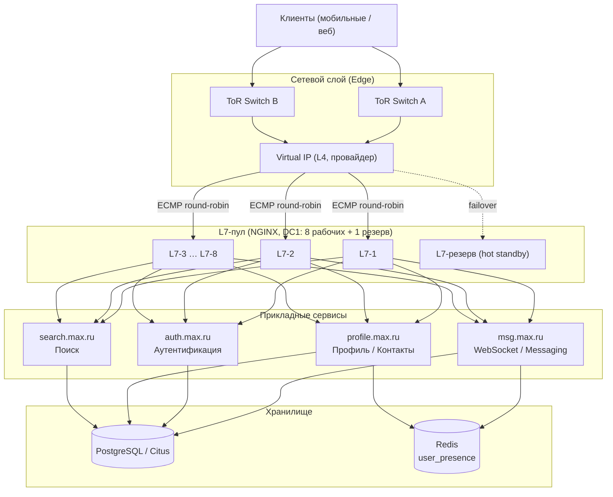

# Исходный код диаграммы: Локальная балансировка нагрузки (раздел 4.4)

```mermaid
flowchart TD
    C["Клиенты (мобильные / веб)"]

    subgraph EDGE["Сетевой слой (Edge)"]
        SW1["ToR Switch A"]
        SW2["ToR Switch B"]
        VIP["Virtual IP (L4, провайдер)"]
    end

    subgraph L7["L7-пул (NGINX, DC1: 8 рабочих + 1 резерв)"]
        L7A["L7-1"]
        L7B["L7-2"]
        L7C["L7-3 … L7-8"]
        L7R["L7-резерв (hot standby)"]
    end

    subgraph APP["Прикладные сервисы"]
        MSG["msg.max.ru\nWebSocket / Messaging"]
        AUTH["auth.max.ru\nАутентификация"]
        PROFILE["profile.max.ru\nПрофиль / Контакты"]
        SEARCH["search.max.ru\nПоиск"]
    end

    subgraph STORE["Хранилище"]
        DB[("PostgreSQL / Citus")]
        REDIS[("Redis\nuser_presence")]
    end

    C --> SW1 & SW2
    SW1 & SW2 --> VIP
    VIP -->|"ECMP round-robin"| L7A & L7B & L7C
    VIP -. "failover" .-> L7R

    L7A & L7B & L7C --> MSG
    L7A & L7B & L7C --> AUTH
    L7A & L7B & L7C --> PROFILE
    L7A & L7B & L7C --> SEARCH

    MSG --> DB & REDIS
    AUTH --> DB
    PROFILE --> DB & REDIS
    SEARCH --> DB
```
