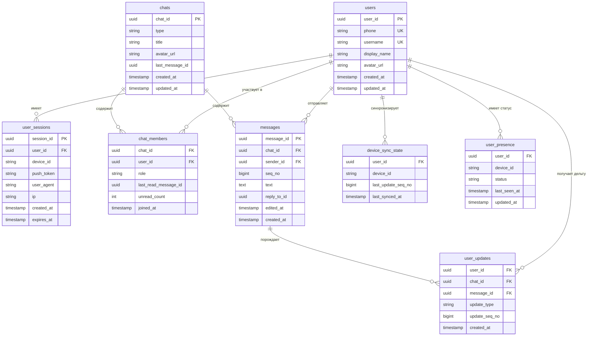

# Исходный код диаграммы: Логическая схема БД (раздел 5.5)

```mermaid
erDiagram
    users {
        uuid user_id PK
        string phone UK
        string username UK
        string display_name
        string avatar_url
        timestamp created_at
        timestamp updated_at
    }

    user_sessions {
        uuid session_id PK
        uuid user_id FK
        string device_id
        string push_token
        string user_agent
        string ip
        timestamp created_at
        timestamp expires_at
    }

    chats {
        uuid chat_id PK
        string type
        string title
        string avatar_url
        uuid last_message_id
        timestamp created_at
        timestamp updated_at
    }

    chat_members {
        uuid chat_id FK
        uuid user_id FK
        string role
        uuid last_read_message_id
        int unread_count
        timestamp joined_at
    }

    messages {
        uuid message_id PK
        uuid chat_id FK
        uuid sender_id FK
        bigint seq_no
        text text
        uuid reply_to_id
        timestamp edited_at
        timestamp created_at
    }

    user_updates {
        uuid user_id FK
        uuid chat_id FK
        uuid message_id FK
        string update_type
        bigint update_seq_no
        timestamp created_at
    }

    device_sync_state {
        uuid user_id FK
        string device_id
        bigint last_update_seq_no
        timestamp last_synced_at
    }

    user_presence {
        uuid user_id FK
        string device_id
        string status
        timestamp last_seen_at
        timestamp updated_at
    }

    users ||--o{ user_sessions : "имеет"
    users ||--o{ chat_members : "участвует в"
    users ||--o{ messages : "отправляет"
    users ||--o{ user_updates : "получает дельту"
    users ||--o{ device_sync_state : "синхронизирует"
    users ||--o{ user_presence : "имеет статус"
    chats ||--o{ chat_members : "содержит"
    chats ||--o{ messages : "содержит"
    messages ||--o{ user_updates : "порождает"
```
