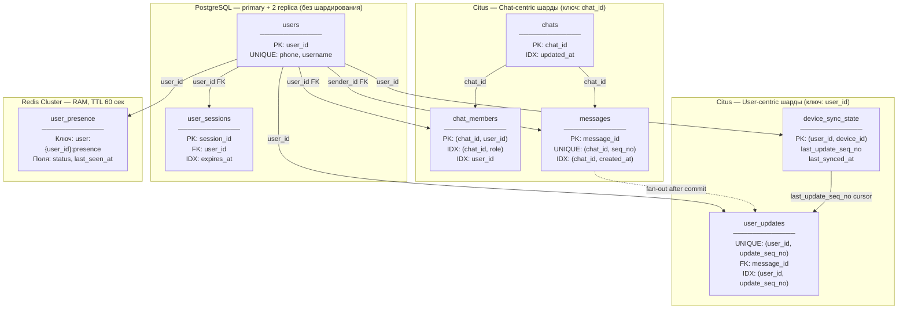

# Исходный код диаграммы: Физическая схема БД (раздел 6)

```mermaid
flowchart TB
    subgraph PG["PostgreSQL — primary + 2 replica (без шардирования)"]
        direction TB
        U["users\n─────────────\nPK: user_id\nUNIQUE: phone, username"]
        US["user_sessions\n─────────────\nPK: session_id\nFK: user_id\nIDX: expires_at"]
    end

    subgraph CITUS_CHAT["Citus — Chat-centric шарды (ключ: chat_id)"]
        direction TB
        C["chats\n─────────────\nPK: chat_id\nIDX: updated_at"]
        CM["chat_members\n─────────────\nPK: (chat_id, user_id)\nIDX: (chat_id, role)\nIDX: user_id"]
        M["messages\n─────────────\nPK: message_id\nUNIQUE: (chat_id, seq_no)\nIDX: (chat_id, created_at)"]
    end

    subgraph CITUS_USER["Citus — User-centric шарды (ключ: user_id)"]
        direction TB
        UU["user_updates\n─────────────\nUNIQUE: (user_id, update_seq_no)\nFK: message_id\nIDX: (user_id, update_seq_no)"]
        DS["device_sync_state\n─────────────\nPK: (user_id, device_id)\nlast_update_seq_no\nlast_synced_at"]
    end

    subgraph REDIS["Redis Cluster — RAM, TTL 60 сек"]
        direction TB
        UP["user_presence\n─────────────\nКлюч: user:{user_id}:presence\nПоля: status, last_seen_at"]
    end

    U -->|"user_id FK"| US
    U -->|"user_id FK"| CM
    U -->|"sender_id FK"| M
    U -->|"user_id"| UP
    U -->|"user_id"| UU
    U -->|"user_id"| DS

    C -->|"chat_id"| CM
    C -->|"chat_id"| M

    M -.->|"fan-out after commit"| UU
    DS -->|"last_update_seq_no cursor"| UU
```
